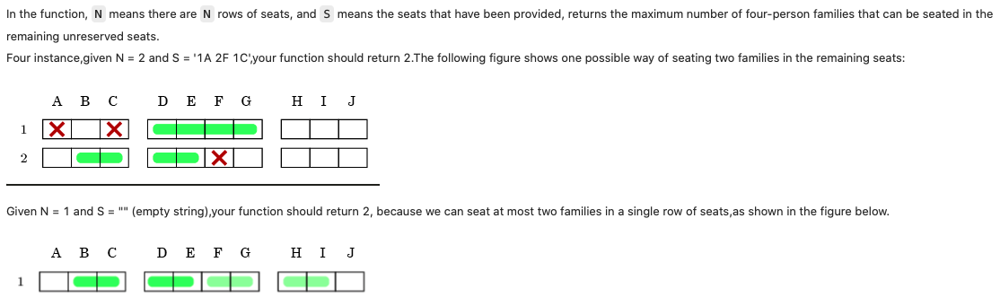

### Aircraft seat
https://www.lintcode.com/problem/1881/



```python
class Solution:
    """
    @param n: the number of rows
    @param s: a list of reserved seats
    @return: An integer
    """
    def solution(self, n: int, s: str) -> int:
        if s == "":
            return n*2

        list_seats = s.split()
        set_BCDE, set_DEFG, set_FGHI = set("BCDE"), set("DEFG"), set("FGHI")

        count = 0
        for row in range(1, n+1):
            bool_BCDE = bool_DEFG = bool_FGHI = True
            for seat in list_seats:
                number = seat[:-1]
                letter = seat[-1]
                if int(number)!=row: continue
                if letter in set_BCDE:
                    bool_BCDE = False
                if letter in set_DEFG:
                    bool_DEFG = False
                if letter in set_FGHI:
                    bool_FGHI = False
            if bool_BCDE and bool_FGHI: count += 2
            elif bool_BCDE: count += 1
            elif bool_FGHI: count += 1
            elif bool_DEFG: count += 1
        return count                           
```

#### Remark:
- Simulation
#### Submission:
```
185 ms
time cost
·
12.48 MB
memory cost
·
Your submission beats
2.56 %
Submissions                                                              
```
#### Complexity:
- Time: O(n*s), where n = num of rows, s = provided seats
- Space: O(s), where s = provided seats
