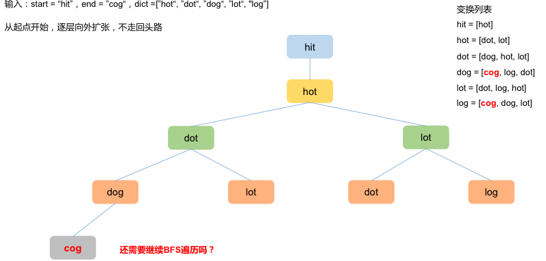

### Word Ladder
https://www.lintcode.com/problem/120/
>Given two words (`start` and `end`), and a set, find the shortest transformation sequence from `start` to `end`, output the length of the sequence.\
>Transformation rule such that:\
>Only one letter can be changed at a time\
>Each intermediate word must exist in the dictionary. (Start and end words do not need to appear in the dictionary ))
>>Return 0 if there is no such transformation sequence.\
>>All words have the same length.\
>>All words contain only lowercase alphabetic characters.\
>>You may assume no duplicates in the dictionary.\
>>You may assume beginWord and endWord are non-empty and are not the same.\
>>len(dict)<=5000,len(start)<5 -> `N(num_of_words)=5000 >> L(size_of_string)=5`

<p>
    
</p>

<p>
    
</p>

```python
from typing import (
    Set, List
)

class Solution:

    def __init__(self):
        self.dict_distance = {}
        self.set_string = set()

    def ladder_length(self, start: str, end: str, dict: Set[str]) -> int:
        """
        @param start: a string
        @param end: a string
        @param dict: a set of string
        @return: An integer
        """

        def get_next_word(word: str) -> List: # Total time O(L^2)
            out_list = []
            for char in range(len(word)): # O(L), L = len_of_string
                left, right = word[:char], word[char+1:] # O(L) to split into substrings
                for letter in 'abcdefghijklmnopqrstuvwxyz': # O(26)
                    if word[char] == letter: continue
                    candidate = str(left+letter+right) # O(L)
                    if candidate in self.set_string: # Typically O(1), but O(L) for keys as strings with unknown length
                        out_list.append(candidate)
            return out_list

        self.set_string = dict
        self.set_string.add(end)

        queue = collections.deque([start])
        self.dict_distance = {start: 1}
        while queue:
            word = queue.popleft() # O(N)
            if word == end:
                return self.dict_distance[word]
            for next_word in get_next_word(word=word): # O(L^2)
                if next_word in self.dict_distance:
                    continue
                queue.append(next_word)
                self.dict_distance[next_word] = self.dict_distance[word] + 1
        return 0
```
#### Remark:
- Assume `N>>L`, then to find if a word of length L could be found in a list of N words, costs O(NL)
  - But here in `get_next_word`, our data structure is `set`
  - Also need to add judgment of post-diff-one-letter rule
  - Outer for loop costs O(L); inner for loop costs O(26L) => O(L^2) in total
  - 知識點1: 哈希表的增刪查改
    - 判斷一個東西是否存在dict裡，一般認為是O(1), 1表size of key, 但是如果是未知長度的字符串，嚴謹一點會說是O(L), where L stands for max length of string
  - 知識點2：把一個string split開，切成sub-strings 或是 合起來
    - 時間複雜度為O(L), where L是string的長度
- Data structure 加東西
  - `set.add()`
  - `deque.append()` 
#### Submission:
```
694 ms
time cost
·
6.95 MB
memory cost
·
Your submission beats
6.80 %
Submissions
```
#### Complexity:
- Time: O(N+L^2)
- Space: O(NL)
