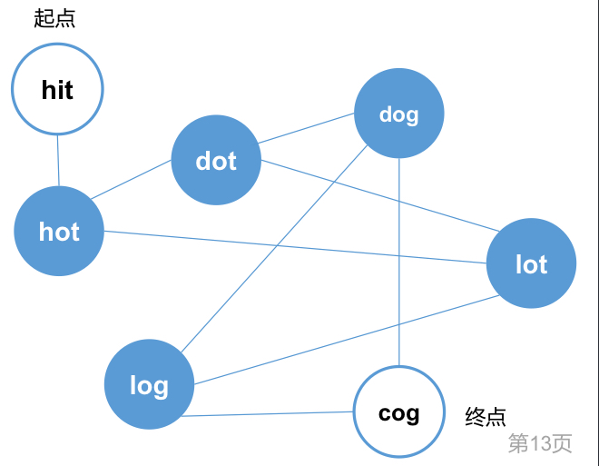

# Word Ladder
https://www.lintcode.com/problem/120/
>Given two words (`start` and `end`), and a set, find the shortest transformation sequence from `start` to `end`, output the length of the sequence.\
>Transformation rule such that:\
>Only one letter can be changed at a time\
>Each intermediate word must exist in the dictionary. (Start and end words do not need to appear in the dictionary ))
>>Return 0 if there is no such transformation sequence.\
>>All words have the same length.\
>>All words contain only lowercase alphabetic characters.\
>>You may assume no duplicates in the dictionary.\
>>You may assume beginWord and endWord are non-empty and are not the same.\
>>len(dict)<=5000,len(start)<5 -> `N(num_of_words)=5000 >> L(size_of_string)=5`

<p>
    
</p>

<p>
    
</p>

## 單向BFS

```python
from typing import (
    Set, List
)

class Solution:

    def __init__(self):
        self.dict_distance = {}
        self.set_string = set()

    def ladder_length(self, start: str, end: str, dict: Set[str]) -> int:
        """
        @param start: a string
        @param end: a string
        @param dict: a set of string
        @return: An integer
        """

        def get_next_word(word: str) -> List: # Total time O(L^2)
            out_list = []
            for char in range(len(word)): # O(L), L = len_of_string
                left, right = word[:char], word[char+1:] # O(L) to split into substrings
                for letter in 'abcdefghijklmnopqrstuvwxyz': # O(26)
                    if word[char] == letter: continue
                    candidate = str(left+letter+right) # O(L)
                    if candidate in self.set_string: # Typically O(1), but O(L) for keys as strings with unknown length
                        out_list.append(candidate)
            return out_list

        self.set_string = dict
        self.set_string.add(end)

        queue = collections.deque([start])
        self.dict_distance = {start: 1}
        while queue:
            word = queue.popleft() # O(N)
            if word == end:
                return self.dict_distance[word]
            for next_word in get_next_word(word=word): # O(L^2)
                if next_word in self.dict_distance:
                    continue
                queue.append(next_word)
                self.dict_distance[next_word] = self.dict_distance[word] + 1
        return 0
```
#### Remark:
- Assume `N>>L`, then typically, to find if a word of length L, with a difference of one letter, could be found in a list of N words, costs O(NL)
    ```python
    def get_next_words(self, word, set):
        next_words = []
        for next_word in set:
            has_one_diff = False
            for i in range(len(word)):
                if (next_word[i] != word[i]):
                    if has_one_diff:
                        has_one_diff = False
                        break
                    has_one_diff = True
            if has_one_diff:
                next_words.append(next_word)
        return next_words
    ```
- However, in `get_next_word()`
  - Outer for loop costs O(L); inner for loop costs O(26L) => O(L^2) in total
  - 知識點1: 哈希表的增刪查改
    - 判斷一個東西是否存在dict裡，一般認為是O(1), 1表size of key, 但是如果是未知長度的字符串，嚴謹一點會說是O(L), where L stands for max length of string
  - 知識點2：把一個string split開，切成sub-strings 或是 合起來
    - 時間複雜度為O(L), where L是string的長度
- Data structure 加東西
  - `set.add()`
  - `deque.append()` 
#### Submission:
```
694 ms
time cost
·
6.95 MB
memory cost
·
Your submission beats
6.80 %
Submissions
```
#### Complexity:
- Time: O(N*L^2)
- Space: O(N*L)

## 單向BFS + Wildcard Query Dict
```python
from typing import (
    Set, List, DefaultDict
)
from collections import defaultdict

class Solution:

    def __init__(self):
        self.dict_distance = {}
        self.set_string = set()
        self.dict_query = defaultdict(set)

    def ladder_length(self, start: str, end: str, dict: Set[str]) -> int:
        """
        @param start: a string
        @param end: a string
        @param dict: a set of string
        @return: An integer
        """

        def build_query_worddict():
            for word in self.set_string:
                for idx in range(len(word)):
                    pre, post = word[:idx], word[idx+1:]
                    self.dict_query[pre+"#"+post].add(word)

        def get_next_word(word: str) -> List: # Total time O(L^2)
            out_list = []
            for char in range(len(word)): # O(L), L = len_of_string
                left, right = word[:char], word[char+1:] # O(L) to split into substrings
                key = left+'#'+right
                for val in self.dict_query[key]:
                    out_list.append(val)
            return out_list

        self.set_string = dict
        self.set_string.add(end)
        build_query_worddict()

        queue = collections.deque([start])
        self.dict_distance = {start: 1}
        while queue:
            word = queue.popleft() # O(N)
            if word == end:
                return self.dict_distance[word]
            for next_word in get_next_word(word=word): # O(L^2)
                if next_word in self.dict_distance:
                    continue
                queue.append(next_word)
                self.dict_distance[next_word] = self.dict_distance[word] + 1
        return 0
```
#### Remark:
- 是由前一版的code做改動，主要的改動是`get_next_word()`的方式，其餘都保持不變
    - before: 遍歷a to z所有字母，將一個字挖空，在每個坑填進去a to z的字母（除了自己），當作可能的next_word
    - after: 在`build_query_worddict()`裡，用`#`的方式，例如`'cat'`這個字會對應`'#at', 'c#t', 'ca#'`三個key, 然後value都會有`cat`這個字
        - 這樣，在`get_next_word()`裡做查找時，也是用`#`的方式找，不用再塞a~z這麼多個字
#### Submission:
```
143 ms
time cost
·
11.65 MB
memory cost
·
Your submission beats
97.40 %
Submissions
```
## 雙向BFS
```python
from typing import (
    Set, List, Deque
)

class Solution:

    def __init__(self):
        self.set_string = set()
        self.distance = 1

    def ladder_length(self, start: str, end: str, dict: Set[str]) -> int:
        """
        @param start: a string
        @param end: a string
        @param dict: a set of string
        @return: An integer
        """

        def get_next_word(word: str) -> List: # Total time O(L^2)
            out_list = []
            for char in range(len(word)): # O(L), L = len_of_string
                left, right = word[:char], word[char+1:] # O(L) to split into substrings
                for letter in 'abcdefghijklmnopqrstuvwxyz': # O(26)
                    if word[char] == letter: continue
                    candidate = str(left+letter+right) # O(L)
                    if candidate in self.set_string: # Typically O(1), but O(L) for keys as strings with unknown length
                        out_list.append(candidate)
            return out_list

        def expand_queue(q: Deque, s: set, opp_set: set)-> bool:
            self.distance += 1
            for _ in range(len(q)):
                word = q.popleft()
                for next_word in get_next_word(word=word):
                    if next_word in s:
                        continue
                    if next_word in opp_set:
                        return True
                    q.append(next_word)
                    s.add(next_word)
            return False

        if start==end: return 1
        self.set_string = dict
        self.set_string.add(end)

        forward_queue = collections.deque([start])
        backward_queue = collections.deque([end])
        forward_set = set([start])
        backward_set = set([end])

        while forward_queue and backward_queue:
            if expand_queue(q=forward_queue, s=forward_set, opp_set=backward_set):
                return self.distance
            if expand_queue(q=backward_queue, s=backward_set, opp_set=forward_set):
                return self.distance
        return -1
```
#### Remark:
- 注意：初始`self.distance`是`1`!
#### Submission:
```
244 ms
time cost
·
6.68 MB
memory cost
·
Your submission beats
94.60 %
Submissions
```
#### Complexity:
- Time: O(N^(1/2)*L^2)
- Space: O(N^(1/2)*L)
