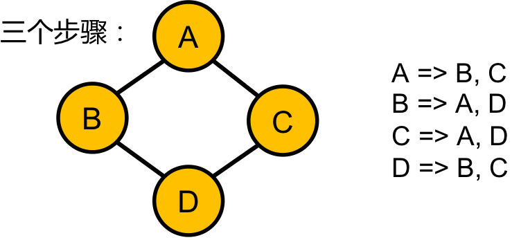

### Clone Graph
https://www.lintcode.com/problem/137/

連通塊問題\
G = <V, E>

<p>
    
</p>

此題解題步驟分三步：
- 找到所有點
- 複製所有點
- 複製所有邊

>Clone an undirected graph. Each node in the graph contains a `label` and a list of its `neighbors`. Nodes are labeled uniquely.
>
>You need to return a deep copied graph, which has the same structure as the original graph, and any changes to the new graph will not have any effect on the original graph.

```python
```
#### Remark:
- 
#### Submission:
```
```
#### Complexity:
- Time:
- Space:
                                                      
                                                      
