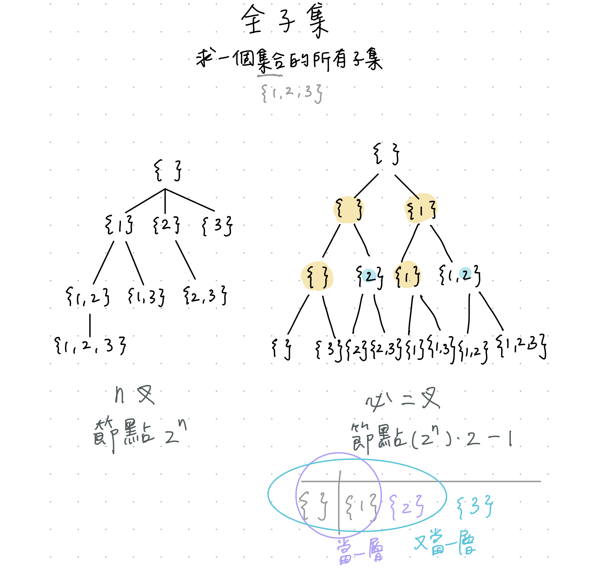
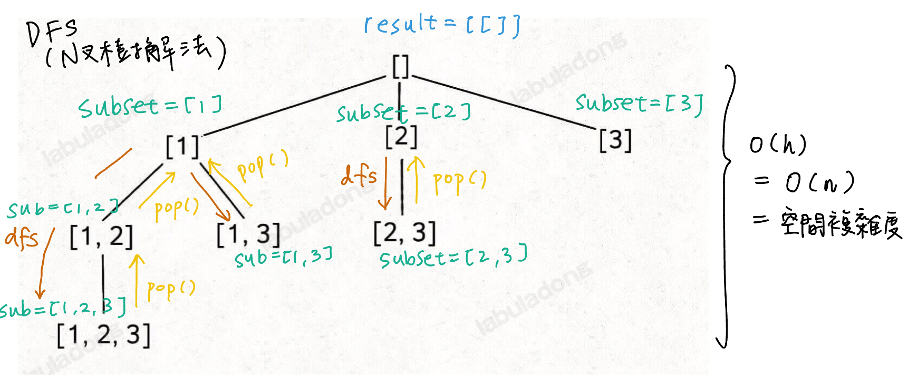

# Subsets
https://www.lintcode.com/problem/17/
>Given a set with distinct integers, return all possible subsets.

## BFS



### N叉樹
- 取queue元素時，沒有真的pop掉頭
  - 只是用一個int去算count
- `while queue` 同理 也是判斷 當前要取的元素還夠取（相當於隊列不空）
- `if`語句：當目前的`subset`存在、並且最後一個數字比即將進來的大的話，不加（為了去重）
- `queue.append(subset + [num])` 是沒有修改到`subset`本身的
   
```python
from typing import (
    List,
)

class Solution:
    
    def subsets(self, nums: List[int]) -> List[List[int]]:
        """
        @param nums: A set of numbers
        @return: A list of lists
                we will sort your return value in output
        """
        
        if not nums:
            return [[]]
        queue = [[]] # len = 0
        q_index_count = 0
        while q_index_count < len(queue):
            subset = queue[q_index_count] # [] -> [1] -> [2] -> [3] -> [1, 2] -> [1, 3] -> [2, 3] -> [1, 2, 3]
            q_index_count += 1
            for num in nums:
                if subset and subset[-1] >= num:
                    continue
                queue.append(subset + [num])
        return queue
```
#### Submission:
```
102 ms
time cost
·
6.07 MB
memory cost
·
Your submission beats
33.20 %
Submissions
```
#### Complexity:
- Time: O(n^2)
- Space: (除了returned queue額外使用的空間）O(2^n)

### 二叉樹
- `sorted(nums)`相當於n叉樹做法中的`if`語句，為了去重
- `subset`是會被修改的(in-place append)
```python
from typing import (
    List,
)

class Solution:
    
    def subsets(self, nums: List[int]) -> List[List[int]]:
        """
        @param nums: A set of numbers
        @return: A list of lists
                we will sort your return value in output
        """
        
        if not nums:
            return [[]]
        queue = [[]] # len = 0
        for num in sorted(nums):
            for i in range(len(queue)):
                subset = list(queue[i])
                subset.append(num)
                queue.append(subset)
                print("num is {} and queue is {}".format(num, queue))
        return queue
```
- std out
  - input: [1,2,3] 
  ```
  num is 1 and queue is [[], [1]]
  num is 2 and queue is [[], [1], [2]]
  num is 2 and queue is [[], [1], [2], [1, 2]]
  num is 3 and queue is [[], [1], [2], [1, 2], [3]]
  num is 3 and queue is [[], [1], [2], [1, 2], [3], [1, 3]]
  num is 3 and queue is [[], [1], [2], [1, 2], [3], [1, 3], [2, 3]]
  num is 3 and queue is [[], [1], [2], [1, 2], [3], [1, 3], [2, 3], [1, 2, 3]]
  ```
#### Submission:
```
101 ms
time cost
·
6.19 MB
memory cost
·
Your submission beats
63.40 %
Submissions
```
#### Complexity:
- Time: O(n^2)
- Space: O(n)

## DFS
### N叉樹（通用性更強，要掌握）
參考BFS N叉樹的圖，節點本身代表的是以`該節點內容`為開頭的子集。\
從下一層**backtracking**到上層。


類似寫法可以參考[Binary Tree Path](https://github.com/chkao831/Algo_learning_notes/blob/main/DFS/LeetCode_257_Binary-Tree-Paths.md#recursive-approach-dfs-postorder-traversal-with-manual-backtracking)這題

```python
from typing import (
    List,
)

class Solution:
    
    def subsets(self, nums: List[int]) -> List[List[int]]:
        """
        @param nums: A set of numbers
        @return: A list of lists
                we will sort your return value in output
        """
        
        def dfs(index: int, subset: List[int]):

            # base: add every combo in the current subset to the returning result
            result.append(list(subset))
            # if there's subsequent index, do recursive call
            for i in range(index, len(nums)):
                subset.append(nums[i])
                dfs(i+1, subset)
                subset.pop() # backtracking

        result = []
        if not nums:
            return [[]]
        nums.sort() # because elements in a subset must be in non-descending order
        dfs(index=0, subset=[])
        return result
```
#### Submission:
```
101 ms
time cost
·
6.09 MB
memory cost
·
Your submission beats
62.80 %
Submissions
```
#### Complexity:
- Time: O(nlogn)
- Space: O(h) = O(n)

### 二叉樹
同樣參考BFS二叉樹的圖，每一層都是**要**`x`與**不要**`x`的選擇。


**Elements in a subset must be in non-descending order.** -> `nums.sort()`
```python
from typing import (
    List,
)

class Solution:
    
    def subsets(self, nums: List[int]) -> List[List[int]]:
        """
        @param nums: A set of numbers
        @return: A list of lists
                we will sort your return value in output
        """
        
        def dfs(index: int, subset: List[int]):
            # base
            if (index==len(nums)):
                result.append(list(subset)) # append deepcopy of subset
                return 

            # choose nums[index]
            subset.append(nums[index])
            dfs(index+1, subset)
            # unchoose nums[index]
            subset.pop()
            dfs(index+1, subset)

        result = []
        if not nums:
            return [[]]
        nums.sort() # because elements in a subset must be in non-descending order
        dfs(index=0, subset=[])
        return result
```
#### Submission:
```
102 ms
time cost
·
6.07 MB
memory cost
·
Your submission beats
32.60 %
Submissions
```
#### Complexity:
- Time: O(nlogn)
- Space: O(h) = O(n)
