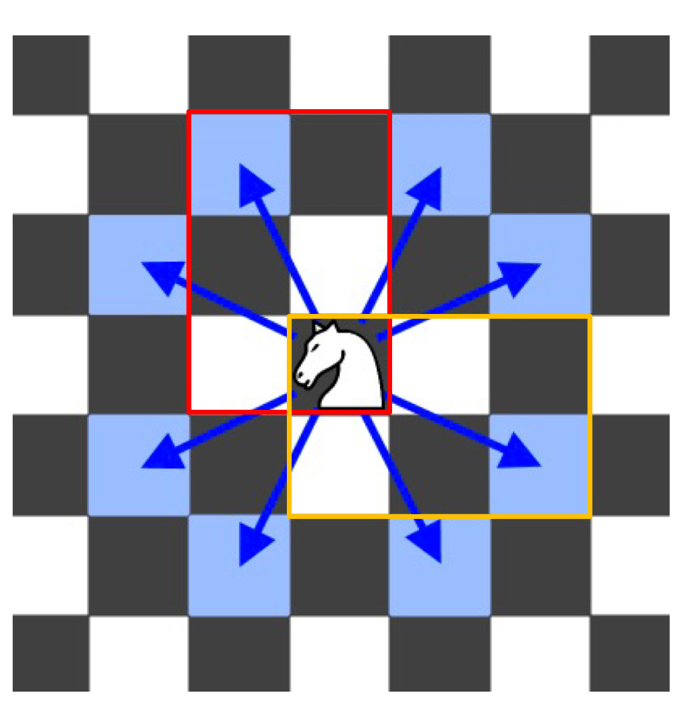

### Knight Shortest Path
https://www.lintcode.com/problem/611/
>Given a knight in a chessboard (a binary matrix with `0` as empty and `1` as barrier) with a source position, find the shortest path to a destination position, return the length of the route.\
>Return `-1` if destination cannot be reached.

<p>
    
</p>

```python
```
#### Remark:
- 
#### Submission:
```
```
#### Complexity:
- Time:
- Space:
