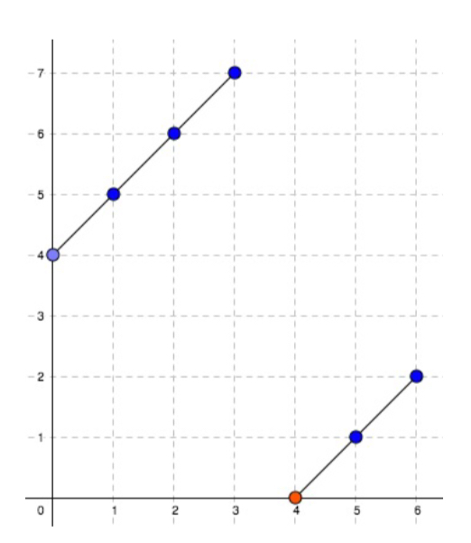

### Find Minimum in Rotated Sorted Array
https://www.lintcode.com/problem/159/
>Suppose a sorted array in ascending order is rotated at some pivot unknown to you beforehand.
>
>(i.e., 0 1 2 4 5 6 7 might become 4 5 6 7 0 1 2).
>
>Find the minimum element.\
>**You can assume no duplicate exists in the array.**



```
[ 4567012 ]
OO...OXX....X
     ^^
  左上｜右下
    ↗ 
  ↗      
          ↗
        ↗
sorted array ∈ rotated sorted array
X的第一個數（右半部分的條件）：必須是<=整個數列最後一個數
```
```python
from typing import (
    List,
)

class Solution:
    """
    @param nums: a rotated sorted array
    @return: the minimum number in the array
    """
    def find_min(self, nums: List[int]) -> int:
        end_val = nums[-1]
        start, end = 0, len(nums)-1
        while start + 1 < end:
            mid = (start+end)//2
            if nums[mid] <= end_val: # Actually, if nums[mid] <= nums[end] works, too
                end = mid
            else:
                start = mid
        return min(nums[start], nums[end])
```
#### Remark:
- Followup: 如果有重複的數，可以證明，無法保證在log(n)的時間內解決
  - 例子[1, 1, 1, 1, ..., 1]裡面藏著一個0, 也是rotated sorted array 
    - 最壞情況是把所有traverse一次，O(n) 
-  X的第一個數（右半部分的條件）：<=整個數列最後一個數, 也可以動態<=當前數列end pointer指向的數即可（稍慢）
#### Submission:
```
81 ms
time cost
·
6.09 MB
memory cost
·
Your submission beats
98.20 %
Submissions
```
#### Complexity:
- Time: O(logn)
- Space: O(1)
