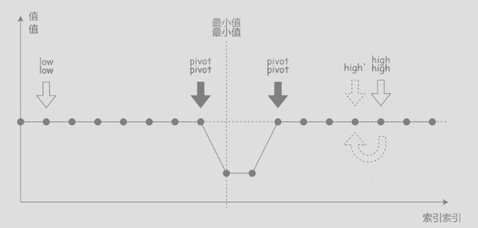

### Find Minimum in Rotated Sorted Array II
https://www.lintcode.com/problem/160/
>Suppose a sorted array is rotated at some pivot unknown to you beforehand.
>
>(i.e., 0 1 2 4 5 6 7 might become 4 5 6 7 0 1 2).
>
>Find the minimum element.\
>**The array may contain duplicates.**

**和[沒重復的旋轉數組](https://github.com/chkao831/Algo_learning_notes/blob/main/BinarySearch/LintCode_159_Find-Minimum-in-Rotated-Sorted-Array.md)很類似， 唯一的區別就是， 當mid和end相等的時候， 只能end--。因為會碰到1 1 -1 1這種case， 你無法知道哪裡凹下去了**




```python
from typing import (
    List,
)

class Solution:
    """
    @param nums: a rotated sorted array
    @return: the minimum number in the array
    """
    def find_min(self, nums: List[int]) -> int:
        start, end = 0, len(nums)-1
        while start + 1 < end:
            mid = (start+end)//2
            if nums[mid] < nums[end]:
                end = mid
            elif nums[mid] == nums[end]:
                end -= 1
            else: # nums[mid] > nums[end]
                start = mid
        return min(nums[start], nums[end])

```
#### Remark:
- 
#### Submission:
```
81 ms
time cost
·
6.09 MB
memory cost
·
Your submission beats
96.40 %
Submissions
```
#### Complexity:
- Time: 平均時間複雜度為O(logn)，其中n是數組的長度。如果數組是隨機生成的，那麼數組中包含相同元素的概率很低，在二分查找的過程中，大部分情況都會忽略一半的區間。而在最壞情況下，如果數組中的元素完全相同，那麼while循環就需要執行n次，每次忽略區間的右端點，時間複雜度為O(n)。
- Space: O(1)
