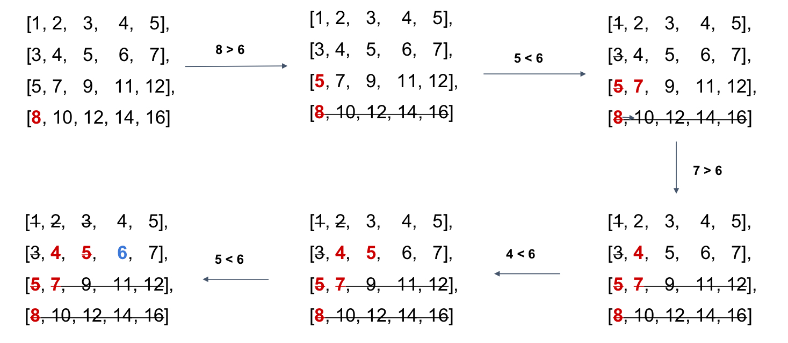

### Search a 2D Matrix II
https://leetcode.com/problems/search-a-2d-matrix-ii/
>Write an efficient algorithm that searches for a value target in an m x n integer matrix matrix. This matrix has the following properties:
>
> - Integers in each row are sorted in ascending from left to right.
> - Integers in each column are sorted in ascending from top to bottom.



```
^
^
^
corner <<<<<<

because strictly increase/decrease,
if corner < target, whole column off
if corner > target, whole row off
if corner == target, both column and row off
```
```python
from typing import (
    List,
)

class Solution:
    """
    @param matrix: A list of lists of integers
    @param target: An integer you want to search in matrix
    @return: An integer indicate the total occurrence of target in the given matrix
    """
    def search_matrix(self, matrix: List[List[int]], target: int) -> int:
        if not matrix or len(matrix)<1:
            return -1
        m, n = len(matrix), len(matrix[0])
        start_i, start_j = m-1, 0
        count = 0
        while start_i >= 0 and start_j < n:
            if matrix[start_i][start_j] == target:
                count += 1
                start_i, start_j = start_i - 1, start_j + 1
            elif matrix[start_i][start_j] < target: # already too small
                start_j += 1
            else: # already too big
                start_i -= 1
        return count
```
#### Remark:
- 因為要算次數 理論的時間複雜度不低於O(n) 只能一個個找到 不太能批量去找
- ```
  想法一：每一row Binary Search
  1 3 5 7
  2 4 7 8
  3 5 9 10
  Each row logn -> nlogn in total -> 太大 （只用到了row有排序的信息）

  想法二：象限排除
  target = 3, matrx[mid]=4
  排除右下角9 10
  1 3 | 5 7
  2 4 | 7 8
  --------
  3 5 | 9 10

  n -> 3/4 n with an operation
  T(n) = 3T(n/2) + O(1) [邊長變一半] -> T(n) = O(n+)
  ```
  以上想法都不太可行
#### Submission:
```
102 ms
time cost
·
6.58 MB
memory cost
·
Your submission beats
42.60 %
Submissions
```
#### Complexity:
- Time: O(m+n) = O(max(m, n)) as its worst case, since each row (or column) might have something to be visited
- Space: O(1)
