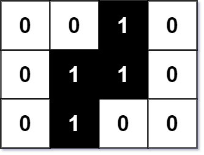

### Smallest Rectangle Enclosing Black Pixels
https://www.lintcode.com/problem/600/
> An image is represented by a binary matrix with 0 as a white pixel and 1 as a black pixel. The black pixels are connected, i.e., there is only one black region. Pixels are connected horizontally and vertically. Given the location (x, y) of one of the black pixels, return the area of the smallest (axis-aligned) rectangle that encloses all black pixels.



Intuition: 暴力解 O(m*n),\
or 四次二分
```
x=0 y=0, 1 2 ...
1 
2
.
.
.


0~x find first row (upper)
x~m-1 find last row (lower)
0~y find first column (left)
y~n-1 find last column (right)
```
其中1,3可以寫成一種二分, 2,4可以寫成第二種二分
| | first_position | last_position |
|-----|-----|-----|
| column-wise | 0~y | y~n-1 |
| row-wise | 0~x | x~m-1 |

```python
from typing import (
    List,
)

class Solution:
    """
    @param image: a binary matrix with '0' and '1'
    @param x: the location of one of the black pixels
    @param y: the location of one of the black pixels
    @return: an integer
    """
    def min_area(self, image: List[List[str]], x: int, y: int) -> int:
        
        def find_first(start: int, end: int, check_func):
            while start + 1 < end:
                mid = (start+end)//2
                if check_func(mid):
                    end = mid
                else:
                    start = mid
            if check_func(start): return start
            else: return end

        def find_last(start: int, end: int, check_func):
            while start + 1 < end:
                mid = (start+end)//2
                if check_func(mid):
                    start = mid
                else:
                    end = mid
            if check_func(end): return end
            else: return start

        def check_column(mid: int):
            for i in range(len(image)):
                if image[i][mid] == '1': return True
            return False

        def check_row(mid: int):
            for j in range(len(image[0])):
                if image[mid][j] == '1': return True
            return False

        if not image or len(image)<1:
            return 0
        m, n = len(image), len(image[0])
        left = find_first(0, y, check_column)
        right = find_last(y, n-1, check_column)
        upper = find_first(0, x, check_row)
        lower = find_last(x, m-1, check_row)

        return (right-left+1)*(lower-upper+1)
```
#### Remark:
- 注意矩陣方向！！！（起始：左上角）
- `image[mid][j] == '1'`, 記得要以char形式判斷`'1'`, not`1`
#### Submission:
```
101 ms
time cost
·
6.21 MB
memory cost
·
Your submission beats
83.00 %
Submissions
```
#### Complexity:
- Time: O(nlogm + mlogn) < Brute Force O(mxn)
  - O(nlogm) twice + O(mlogn) twice 
- Space: O(1)
