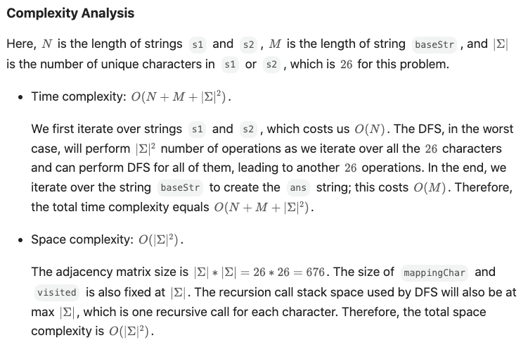

### Lexicographically Smallest Equivalent String 
https://leetcode.com/problems/lexicographically-smallest-equivalent-string/
>Return the lexicographically smallest equivalent string of `baseStr` by using the equivalency information from `s1` and `s2`.
```python
from typing import Set

class Solution:
    def smallestEquivalentString(self, s1: str, s2: str, baseStr: str) -> str:
        
        def s1s2toMatrix(mapping_matrix: List[List[int]]):
            for i in range(len(s1)):
                ord_1, ord_2 = ord(s1[i]) - ord('a'), ord(s2[i]) - ord('a')
                mapping_matrix[ord_1][ord_2] = 1
                mapping_matrix[ord_2][ord_1] = 1
            return mapping_matrix

        def dfs(starting_idx: int, mutual_components: Set[int], current_min: int):
            nonlocal visited_bool
            mutual_components.add(starting_idx)
            visited_bool[starting_idx] = True
            current_min = min(current_min, starting_idx)
            for neigh in range(26):
                if mapping_matrix[starting_idx][neigh] and not visited_bool[neigh]:
                    current_min = dfs(neigh, mutual_components, current_min)
            return current_min
        
        mapping_matrix = [[0 for i in range(26)] for j in range(26)]
        mapping_matrix = s1s2toMatrix(mapping_matrix)
        visited_bool = [False for _ in range(26)]
        min_map = [i for i in range(26)]
        for starting_idx in range(26):
            if visited_bool[starting_idx]:
                continue
            mutual_components, current_min = set(), 27
            current_min = dfs(starting_idx, mutual_components, current_min)
            for comp in mutual_components:
                min_map[comp] = current_min

        out = []
        for s in baseStr:
            out.append(chr(min_map[ord(s)-ord('a')]+ord('a')))
        return ''.join(out)
```
#### Remark:
- 關鍵：建立
  - mapping matrix, 類似correlation map, 把關係抓住
  - min map, 一個1D list, 存儲目前該位置最小元素 
- dfs
  - top down, 從切入點下去，從有關聯的元素找最低的
- 在外面針對每個目標元素call dfs, 
  - 每次dfs前，啟用一個mutual components set, 完事了把關聯元素全部更新成最小元素，藉此更新min map 
#### Submission:
```
Runtime
47 ms
Beats
38.45%

Memory
14.2 MB
Beats
8.23%
```
#### Complexity:

<p>
    
</p>
