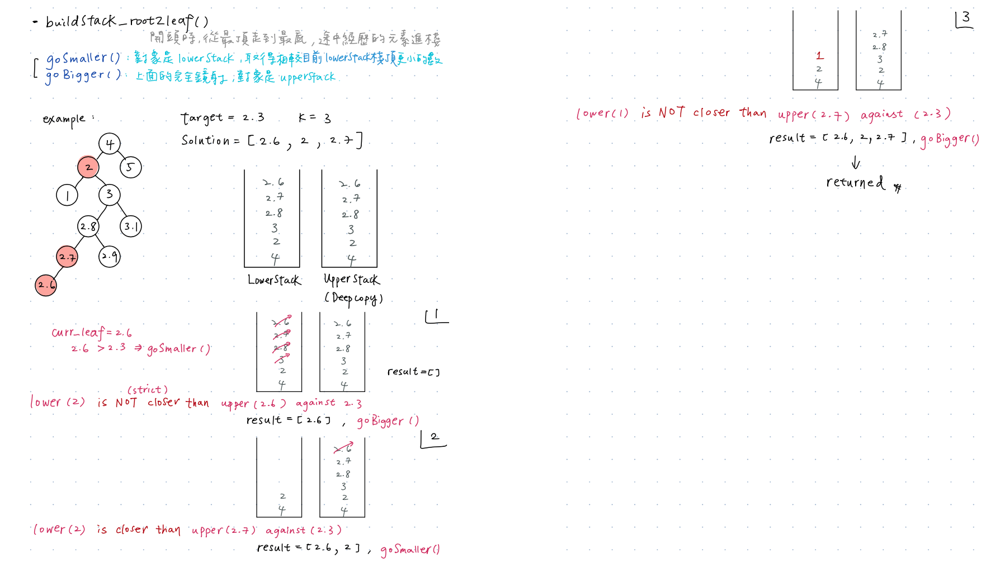

## Closest Binary Search Tree Value II
https://leetcode.com/problems/closest-binary-search-tree-value-ii/
>Given the `root` of a binary search tree, a `target` value, and an integer `k`, return the `k` values in the BST that are closest to the `target`. **You may return the answer in any order.**
>
>**You are guaranteed to have only one unique set of k values in the BST that are closest to the target.**

### 方法一：直觀，先in-order traverse，然後binary search定位，用雙指針判斷
Binary search + Two pointers 找最近的K: [Lint 460 - Find K Closest Elements](https://github.com/chkao831/Algo_learning_notes/blob/main/BinarySearch/LintCode_460_Find-K-Closest-Elements.md)
```python
# Definition for a binary tree node.
# class TreeNode:
#     def __init__(self, val=0, left=None, right=None):
#         self.val = val
#         self.left = left
#         self.right = right
class Solution:
    def closestKValues(self, root: Optional[TreeNode], target: float, k: int) -> List[int]:
        
        def inOrderTrav() -> list: # O(n)
            def _leftIter(node: TreeNode):
                while node:
                    stack.append(node)
                    node = node.left
            stack, out = [], []
            if not root: return stack
            _leftIter(root)
            while stack:
                node = stack.pop()
                out.append(node.val)
                _leftIter(node.right)
            return out
        
        def binarySearch() -> int: # O(logN)
            left, right = 0, len(sorted_vals)-1
            while left + 1 < right:
                mid = (left+right)//2
                if sorted_vals[mid] >= target:
                    right = mid
                else: # sorted_vals[mid] < target
                    left = mid
            if sorted_vals[left] >= target: return left
            if sorted_vals[right] >= target: return right
            return len(sorted_vals)
        
        def left_closer(right: int, left: int) -> bool:
            if left < 0: return False
            if right >= len(sorted_vals): return True
            return True if (abs(sorted_vals[left]-target) <= abs(sorted_vals[right]-target)) else False
        
        sorted_vals = inOrderTrav()
        if not sorted_vals: return
        bigger_right = binarySearch()
        smaller_left = bigger_right - 1
        out = []
        for _ in range(k):
            if left_closer(bigger_right, smaller_left):
                out.append(sorted_vals[smaller_left])
                smaller_left -= 1
            else:
                out.append(sorted_vals[bigger_right])
                bigger_right += 1
        return out
```
#### Remark:
- Made some mistake: (Need to review [Lint460](https://github.com/chkao831/Algo_learning_notes/blob/main/BinarySearch/LintCode_460_Find-K-Closest-Elements.md))
  - `binary_search()`最後兩句判斷忘記加等號了 
  - return `len(a)` in `binary_search()` if no bigger/equal value is found (every element in `sorted_vals` are too small)
  - in `left_closer()`, `if right >= len(sorted_vals)`, **return True**!
#### Submission:
```
Runtime: 104 ms, faster than 33.85% of Python3 online submissions for Closest Binary Search Tree Value II.
Memory Usage: 16.3 MB, less than 71.11% of Python3 online submissions for Closest Binary Search Tree Value II.
```
#### Complexity:
- Time: O(n) (In-order Traversal) + O(log n + k) (Binary Search) = O(n)
- Space: O(n)

### 方法二：使用兩個Iterator
一個Iterator goSmaller, move forward to the next smaller node\
另一個Iterator goBigger, move backward to the next bigger node (寫法完全鏡射）



```python
class Solution:
    def closestKValues(self, root: Optional[TreeNode], target: float, k: int) -> List[int]:
        
        def buildStack_root2leaf(parent_root: TreeNode) -> List[TreeNode]:
            stack, root = [], parent_root
            while root:
                stack.append(root)
                if root.val > target:
                    root = root.left
                else: # root.val <= target
                    root = root.right
            return stack
        
        def goSmaller():
            ''' Go to the next smaller node. '''
            stackTop = lowerStack[-1] # peek stack top
            if stackTop.left: # stackTop has left child
                node = stackTop.left
                while node:
                    lowerStack.append(node)
                    node = node.right
            else: # stackTop has no left child
                node = lowerStack.pop()
                while lowerStack and lowerStack[-1].left == node:
                    node = lowerStack.pop()
                
        def goBigger(): # mirrored from goSmaller
            stackTop = upperStack[-1] # peek stack top
            if stackTop.right:
                node = stackTop.right
                while node:
                    upperStack.append(node)
                    node = node.left
            else:
                node = upperStack.pop()
                while upperStack and upperStack[-1].right == node:
                    node = upperStack.pop()
        
        def lowerIsCloser() -> bool:
            if not lowerStack:
                return False
            if not upperStack:
                return True
            lowerStackTopVal = lowerStack[-1].val
            upperStackTopVal = upperStack[-1].val
            return True if (abs(lowerStackTopVal - target) < abs(upperStackTopVal - target)) else False
        
        lowerStack = buildStack_root2leaf(parent_root=root)
        upperStack = list(lowerStack) # deep copy
        curr_leaf = lowerStack[-1]
        if curr_leaf.val > target: goSmaller()
        else: goBigger()
        result = []
        for _ in range(k):
            if lowerIsCloser():
                result.append(lowerStack[-1].val)
                goSmaller()
            else:
                result.append(upperStack[-1].val)
                goBigger()
        return result
```
#### Submission:
```
Runtime: 53 ms, faster than 92.97% of Python3 online submissions for Closest Binary Search Tree Value II.
Memory Usage: 16.2 MB, less than 90.62% of Python3 online submissions for Closest Binary Search Tree Value II.
```
#### Complexity:
- Time: O(n)
- Space: O(n)
