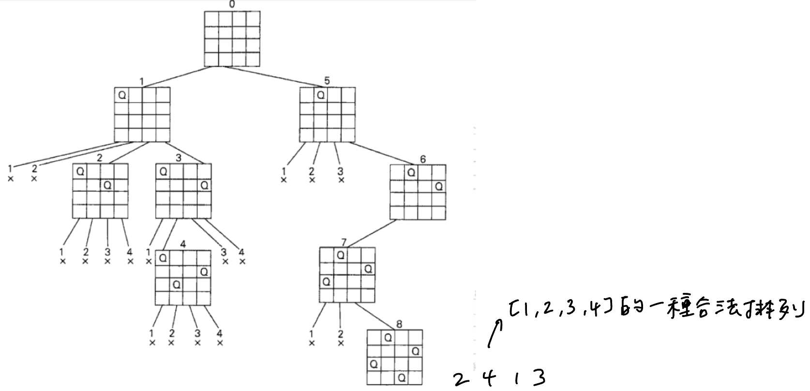

### N-Queens
https://leetcode.com/problems/n-queens/
>Given an integer `n`, return all distinct solutions to the n-queens puzzle. You may return the answer in any order.

<p>
    
</p>

<p>
    
</p>

```python
class Solution:
    def solveNQueens(self, n: int) -> List[List[str]]:
        
        def draw_output(final_cols: List[int]) -> List[str]:
            out = []
            for row in range(n):
                list_str = []
                for col in range(n):
                    if final_cols[row] == col:
                        list_str.append("Q")
                    else:
                        list_str.append(".")
                out.append(''.join(list_str))
            return out

        def is_valid(col: int, row: int, valid_cols: List[int]) -> bool:
            """
                     col=j        / r+c = i+j
            i-1, j-1      i-1, j+1
                     i, j
            i+1, j-1      i+1, j+1
                                   \ r-c = i-j
            """
            for valid_row, valid_col in enumerate(valid_cols):
                if col == valid_col:
                    return False
                if row - col == valid_row - valid_col or row + col == valid_row + valid_col:
                    return False
            return True
        
        def dfs(valid_cols: List[int]):
            nonlocal outputs
            # nonlocal outputs
            current_row = len(valid_cols)
            # base
            if current_row == n:
                sol = draw_output(final_cols=valid_cols)
                outputs.append(list(sol))
                return
            # recursive
            for col in range(n):
                if not is_valid(col, current_row, valid_cols):
                    continue
                valid_cols.append(col)
                dfs(valid_cols)
                valid_cols.pop()
        
        outputs = []
        dfs(valid_cols=[])
        return outputs
```
#### Remark:
- `draw_outputs()`裡nested loop兩個list initialized的位置有些confused:
    - 一個大list, return用的
    - 一個小list, intermediate裝list of str, 每個row都要起乾淨的
- 判斷皇后規則：
    - 豎的
    - 斜的：r-c和r+c不能相同  
     ```
                     col=j         / r+c = i+j
            i-1, j-1      i-1, j+1
                     i, j
            i+1, j-1      i+1, j+1
                                   \ r-c = i-j
     ```
- 還有優化空間的函數：
    - `is_valid()` 目前寫法是O(N)
        - 可以通過三個哈希表，紀錄哪些col, 右斜對角線(addition), 和左斜對角線(subtraction)已經被占
        - 可以優化此函數的O(N)->O(1), 但是整體Time Complexity不會降(這個O(N)本來就不是bottleneck)
        - 這三個哈希表在dfs前要append, dfs後要鏡像backtrack     
#### Submission:
```
Runtime: 163 ms, faster than 34.68% of Python3 online submissions for N-Queens.
Memory Usage: 14.3 MB, less than 94.91% of Python3 online submissions for N-Queens.
```
#### Complexity:
- Time: O(方案總數*構建每個方案的時間) = O(solution * N^2), where solution << N!
- Space: O(N^2)
