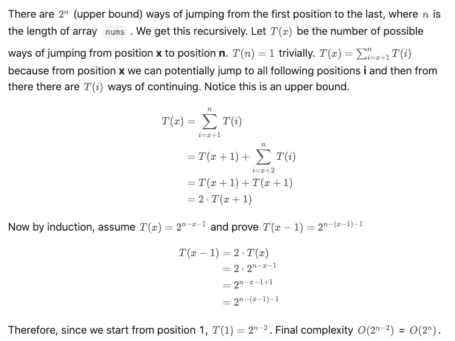

### Jump Game
https://leetcode.com/problems/jump-game/description/
> You are given an integer array nums. You are initially positioned at the array's first index, and each element in the array represents your maximum jump length at that position.
>
>Return `true` if you can reach the last index, or `false` otherwise.

We start from the first position and jump to every index that is reachable. We repeat the process until last index is reached. When stuck, backtrack.
```python
class Solution:
    def canJump(self, nums: List[int]) -> bool:
        
        @lru_cache(None)
        def dfs(cur_idx: int) -> bool:
            if cur_idx >= len(nums) - 1:
                return True
            for feasible_step in range(nums[cur_idx], 0, -1):
                trial = dfs(cur_idx + feasible_step)
                if trial:
                    return True
            return False

        return dfs(cur_idx=0)
```
#### Remark:
- Inefficient. Should use DP.
#### Submission:
```
Runtime
5903 ms
Beats
5.33%

Memory
31.8 MB
Beats
5.17%
```
#### Complexity:

- Time: O(2^N)

<p>
    
</p>

- Space: O(N)
