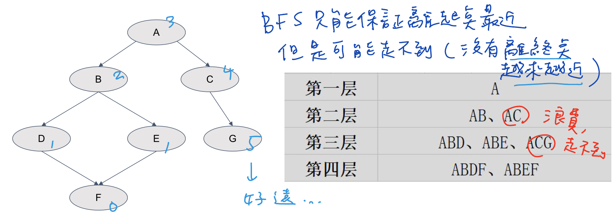

### Word Ladder II
https://www.lintcode.com/problem/121/
>Given two words (`start` and `end`), and a dictionary, **find all shortest transformation sequence(s) from start to end.**

- 找**所有**的**最短**路徑
  - 所有：DFS
  - 最短：BFS 
- 分析
  - 直接DFS(X)
    - 把所有路徑都找一遍，會找到很多非可行解/次優解(不是最短的路）=> 超時，浪費
  - 直接BFS(X)
    - BFS不再是求一條最短路徑，而是多條，那麼隊列裡就不能存一個點了，而是要存一條路
      - 但是，從起點開始走，BFS只能保證目前走的路離起點最近，但是有可能走不到（並沒有保證離終點越來越近）
      - 那麼隊列裡存的東西就有許多浪費、根本走不到的路徑
    <p>
        
    </p>
  - BFS + DFS(O)
    - 先從終點開始，用BFS求出**所有點到終點的（最短）距離**，存起來
    - 然後，從起點開始，沿著**離終點越來越近**的路線找到所有最短路徑（也可以不用DFS, 用BFS再從頭走）
- 以下`build_query_worddict()`和`get_next_word()`完全參照[Word Ladder I](https://github.com/chkao831/Algo_learning_notes/blob/main/BFS/LintCode_120_Word-Ladder.md)裡面單向BFS+Wildcard Query Dict的寫法。
  - 在`build_query_worddict()`裡，用#的方式，例如`'cat'`這個字會對應`'#at', 'c#t', 'ca#'`三個key, 然後其value都會有`cat`這個字
  - 這樣，在`get_next_word()`裡做查找時，也是用#的方式找，不用再塞a~z這麼多個字

```python
from typing import (
    List, Set, DefaultDict, Deque
)
from collections import defaultdict

class Solution:

    def __init__(self):
        self.dict_distance = {}
        self.set_string = set()
        self.dict_query = defaultdict(set)

    def find_ladders(self, start: str, end: str, dict: Set[str]) -> List[List[str]]:
        """
        @param start: a string
        @param end: a string
        @param dict: a set of string
        @return: a list of lists of string
                we will sort your return value in output
        """

        def build_query_worddict():
            for word in self.set_string:
                for idx in range(len(word)):
                    pre, post = word[:idx], word[idx+1:]
                    self.dict_query[pre+"#"+post].add(word)

        def get_next_word(word: str) -> List: # Total time O(L^2)
            out_list = []
            for char in range(len(word)): # O(L), L = len_of_string
                left, right = word[:char], word[char+1:] # O(L) to split into substrings
                key = left+'#'+right
                for val in self.dict_query[key]:
                    out_list.append(val)
            return out_list

        def bfs():
            queue = collections.deque([end])
            self.dict_distance = {end: 1}
            while queue:
                word = queue.popleft()
                # if word==start:
                #     return
                for neigh in get_next_word(word):
                    if neigh in self.dict_distance:
                        continue
                    self.dict_distance[neigh] = self.dict_distance[word] + 1
                    queue.append(neigh)
        
        def dfs(current_word: str, path: List[str], visited_word: List[str]):
            if current_word == end:
                results.append(list(path))
                return
            for next_word in get_next_word(current_word):
                if not (self.dict_distance[next_word]==self.dict_distance[current_word]-1) or next_word in visited_word:
                    continue
                path.append(next_word)
                visited_word.append(next_word)
                dfs(next_word, path, visited_word)
                visited_word.pop()
                path.pop()
                
        self.set_string = dict
        self.set_string.add(start)
        self.set_string.add(end)
        build_query_worddict()

        results = []
        bfs()
        dfs(current_word=start, path=[start], visited_word=[])
        return results

```
#### Remark:
- Mistake: 因爲透過BFS建立的distance dict要給DFS用，不能在base case `if word==start:`時就做return, 要查完他的鄰居然後把距離加上去，不然DFS裡查next_word時可能會報錯。
#### Submission:
```
182 ms
time cost
·
14.84 MB
memory cost
·
Your submission beats
95.20 %
Submissions
```
#### Complexity:
- Time: O(NL^2) for BFS, then DFS
  - DFS: Assuming that every layer except the first and the last layer in the DAG has x number of words and is fully connected to the next layer. Let 
h represents the height of the DAG, then the total number of paths will be x^h. 
- Space: Space: O(N*L) (for adjacency storage)
