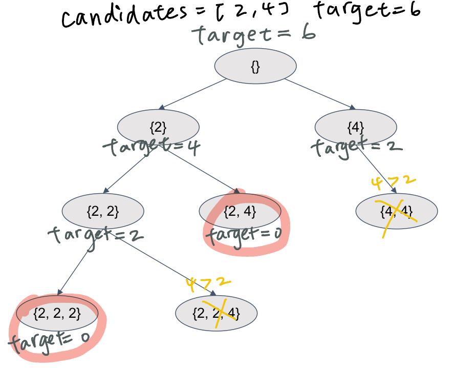

### Combination Sum
https://www.lintcode.com/problem/135/
>Given a set of candidate numbers candidates and a target number target. Find all unique combinations in candidates where the numbers sums to target.
>
>**The same repeated number may be chosen from candidates unlimited number of times.**

<p>
    
</p>

```python
from typing import (
    List,
)

class Solution:
    """
    @param candidates: A list of integers
    @param target: An integer
    @return: A list of lists of integers
             we will sort your return value in output
    """
    def combination_sum(self, candidates: List[int], target: int) -> List[List[int]]:

        def dfs(sub: List[int], t: int, startingIndex: int):
            if t < 0:
                return
            if t == 0:
                result.append(list(sub))

            for idx in range(startingIndex, len(candidates)):
                sub.append(candidates[idx])
                dfs(sub, t-candidates[idx], idx)
                sub.pop()

        result = []
        if not candidates or target <= 0:
            return result
        candidates = sorted(set(candidates))
        dfs(sub=[], t=target, startingIndex=0)
        return result
```
#### Remark:
- The same repeated number may be chosen from candidates unlimited number of times.
  - This implies 在iterate candidates時雖然要由小到大，但是要從自己開始，不能跳過自己！（不能`startingIndex+1`)
- 直接在recursive call做`t-candidates[idx]`相當於
  - 在dfs前`t-=candidates[idx]`然後在dfs後`t+=candidates[idx]`
  - 因為沒有改動值，所以不用手動回溯
- 第一次寫忘記去重＋排序了
  - 去重是因為寫法已經包括取自己多次了
  - 排序是為了避免重複答案（Find all unique combinations）-> 取大值以後就不要回頭了。
- 想要避免`sub`的手動回溯也有辦法做到（也不用在base case append deep copy了）
  - 可以在recursive call裡`sub=sub+[candidates[idx]]`
  - **加號就直接deepcopy了**
#### Submission:
```
101 ms
time cost
·
6.08 MB
memory cost
·
Your submission beats
63.60 %
Submissions
```
#### Complexity:
- Time: 
- Space: O(n)
