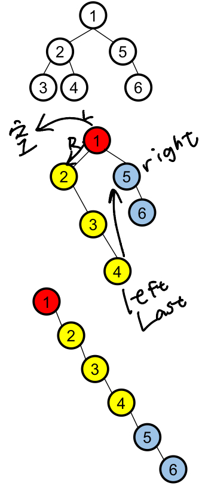

### Flatten Binary Tree to Linked List
https://www.lintcode.com/problem/453/
> Flatten a binary tree to a fake "linked list" in pre-order traversal.
>
>Here we use the right pointer in TreeNode as the next pointer in ListNode.

- Pre-order: 左 -> 右 -> 根
- 樹的鏈表 ＝ 樹的根節點 ＋ 左子樹鏈表 ＋ 右子樹鏈表



```python
```
#### Remark:
- 
#### Submission:
```
```
#### Complexity:
- Time:
- Space:
