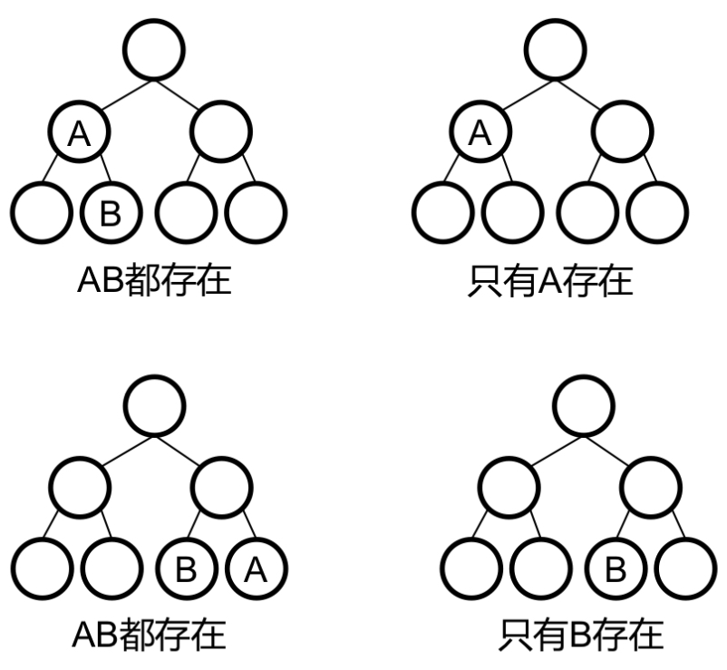

## Lowest Common Ancestor III
https://www.lintcode.com/problem/578/
>給定二叉樹的根節點和兩個子節點，找到兩個節點的最近公共父節點(LCA)。最近公共祖先是兩個節點的公共的祖先節點且具有最大深度。\
>返回 null 如果兩個節點在這棵樹上不存在最近公共祖先的話。\
>**假設給出的兩個節點不一定在樹中存在**，每個節點的值都不同(但其實不影響，因為比的是內存地址)



### 方法：分治法 + 有啥return啥
- 加flag
  - `a_exist`: 如果左邊有A 或 右邊有A 或 這顆node本身就是A
  - `b_exist`: 如果左邊有B 或 右邊有B 或 這顆node本身就是B
- 定義返回值：
  - [最優先] 兩棵樹都存在AB -> 這個root是LCA, return LCA(A,B)
  - 只有一邊 -> return 這一棵樹
  - 只有另一邊 -> return 另一棵樹
  - 左右子樹啥都沒有 -> return None
```python
from typing import Tuple
"""
Definition of TreeNode:
class TreeNode:
    def __init__(self, val):
        this.val = val
        this.left, this.right = None, None
"""


class Solution:
    """
    @param: root: The root of the binary tree.
    @param: A: A TreeNode
    @param: B: A TreeNode
    @return: Return the LCA of the two nodes.
    """

    def lowestCommonAncestor3(self, root, A, B):
        
        def divide_and_conquer(node: "TreeNode") -> Tuple[bool, bool, TreeNode]:
            if not node:
                return False, False, None

            left_a, left_b, left_div = divide_and_conquer(node.left)
            right_a, right_b, right_div = divide_and_conquer(node.right)
            
            a_visited =  left_a or right_a or A==node
            b_visited = left_b or right_b or B==node
            
            if A==node or B==node: # is root
                return (a_visited, b_visited, node)
            
            if left_div and right_div:
                return (a_visited, b_visited, node)
            if left_div:
                return (a_visited, b_visited, left_div)
            if right_div:
                return (a_visited, b_visited, right_div)
            return (a_visited, b_visited, None)

        a_bool, b_bool, lca = divide_and_conquer(root)
        return lca if (a_bool and b_bool) else None
```
#### Remark:
- 和[LCA-I](https://github.com/chkao831/Algo_learning_notes/blob/main/DFS/LintCode_88_Lowest-Common-Ancestor-of-a-Binary-Tree.md)不同的是，兩個節點未必在樹中出現。
  - Different Approaches:
    - 添加兩個bool, 作為recursive call的返回值
    - 在所有return statement前，***先***進行兩個bool的判斷
#### Submission:
```
1224 ms
time cost
·
8.60 MB
memory cost
·
Your submission beats
48.80 %
Submissions
```
#### Complexity:
- Time: O(n)
- Space: O(h) ~O(n)
