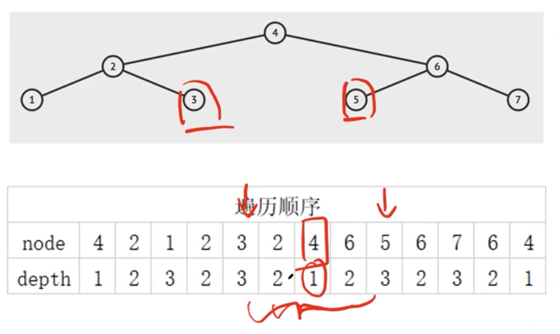

## Lowest Common Ancestor of a Binary Tree
https://www.lintcode.com/problem/88/
>給定二叉樹的根節點和兩個子節點，找到兩個節點的最近公共父節點(LCA)。最近公共祖先是兩個節點的公共的祖先節點且具有最大深度。
>
>**假設給出的兩個節點都在樹中存在**


### 方法: 分治法 + 有啥return啥
- 定義返回值：
  - [最優先] 兩棵樹都存在AB -> 這個root是LCA, return LCA(A,B)
  - 只有一邊 -> return 這一棵樹
  - 只有另一邊 -> return 另一棵樹
  - 左右子樹啥都沒有 -> return None
```python
"""
Definition of TreeNode:
class TreeNode:
    def __init__(self, val):
        self.val = val
        self.left, self.right = None, None
"""


class Solution:
    
    def lowestCommonAncestor(self, root, A, B):
        """
        @param: root: The root of the binary tree.
        @param: A: A TreeNode in a Binary.
        @param: B: A TreeNode in a Binary.
        @return: Return the least common ancestor(LCA) of the two nodes.
        """
        
        if not root:
            return None
        if A==root or B==root:
            return root

        left_div = self.lowestCommonAncestor(root.left, A, B)
        right_div = self.lowestCommonAncestor(root.right, A, B)
        if left_div and right_div:
            return root
        if left_div:
            return left_div
        if right_div:
            return right_div
        return None
```
#### Remark:
- 
#### Submission:
```
1144 ms
time cost
·
12.28 MB
memory cost
·
Your submission beats
8.40 %
Submissions
```
#### Complexity:
- Time: O(n)
- Space: O(h) ~O(n)

### 方法: 直接遍歷
找出兩個節點之間深度最小的節點
- 優：支持多次在線查詢(Online Algorithm)
- 劣：會走到（多次）重複的路
不用知道怎麼寫，但知道有這個概念就好。



要找3&5, 從兩邊包起來的區段取深度最小，答案是node 4
