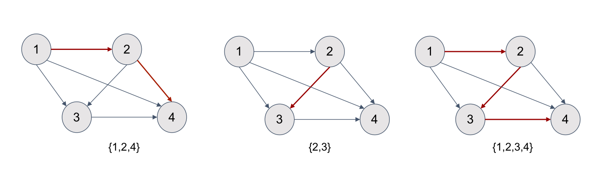
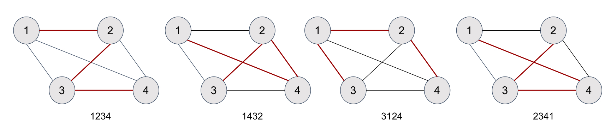
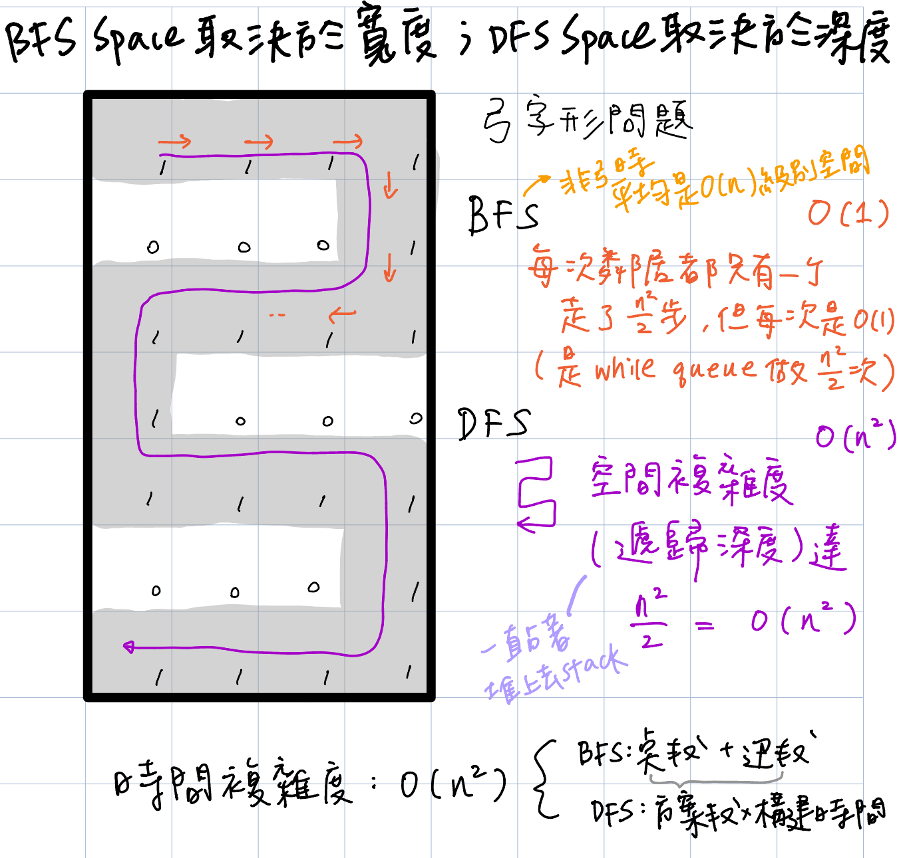

# Depth First Search (DFS, 深度優先搜索）

- 碰到**找所有方案的題**，基本可以確定是DFS
  - e.g. 找到圖中的所有滿足條件的路徑，路徑=方案=途中節點的排列，有時候不像二叉樹直接給一個圖，**點、邊、路徑**需要自己去分析。 
- 通常使用Recursion(遞歸)來實現
  - Recursion: 當多重循環層數不確定的時候，一個更優雅地實現多重循環的方式。
  - 遞歸三要素：1. 遞歸的定義 2. 遞歸的拆解 3. 遞歸的出口(base case) 
- 也可以不用Recursion（太深，怕StackOverflow時）, 如使用手動創建的Stack(棧)進行操作
- Backtracking(回溯)：即深度優先搜索算法
  - 遞歸函數在回到上一層遞歸調用處的時候，一些參數需要改回到調用前的值，回溯就是讓狀態函數回到之前的值的動作。 
  - 訣竅：在改動之後，**以`dfs()` recursive call為鏡子做鏡像操作改回來**
- 二叉樹(binary tree)
  - 是每個節點最多有兩個子樹的樹結構
  - 高度最壞O(n), 最好O(logn)--Balanced Binary Tree, 一般用O(h)表示
  - 遇到二叉樹的問題，就想想**整棵樹**在該問題上的結果和**左右子樹**在該問題上的結果之間有什麼聯繫
  - 一棵二叉樹有O(n)棵子樹：葉子節點自己也是一棵
    - 定義：**任何一個節點作為根**，其下走到最下面，是一棵子樹 
- 通用的時間複雜度
  - **O(方案總數 * 構造每個方案的時間)**
  - 方案總數 = 路徑數


 
## Traversal (遍歷) 
親力親為，一個小人拿著本子走遍所有的節點\
層序遍歷 (Level-order Traversal)詳見[BFS](https://github.com/chkao831/Algo_learning_notes/tree/main/BFS)


### [Pre-Order Traversal](https://github.com/chkao831/Algo_learning_notes/blob/main/DFS/LeetCode_144_Binary-Tree-Preorder-Traversal.md)(前序遍歷)
順序是根節點、左子節點、右子節點，根排在前面。\
`[1, 2, 4, 7, 8, 5, 3, 6, 9, 10]`
### [In-Order Traversal](https://github.com/chkao831/Algo_learning_notes/blob/main/DFS/LeetCode_94_Binary-Tree-Inorder-Traversal.md)(中序遍歷)
順序是左子節點、根節點、右子節點，根排在中間。\
`[7, 4, 8, 2, 5, 1, 3, 9, 6, 10]`
- Relevant: [Leet173 - Binary Search Tree Iterator](https://github.com/chkao831/Algo_learning_notes/blob/main/DFS/LeetCode_173_Binary-Search-Tree-Iterator.md)
- BST (Binary Search Tree): 
  - 左子樹都比根節點小(<)
  - 右子樹都不小於(>=)根節點
  - 使用**中序遍歷**返回排序序列 (BST -> 保證 In-order)
  - 考的話，通常需要掌握中序遍歷的非遞歸版本
  - Red-Black Tree
    - 一種Balacned BST
    - Capabilities: 
      - O(logN)增刪查改
      - O(logN)找最大/最小
      - O(logN)找小於某數的upperBound/大於某數的lowerBound
  - BST Relevant:
    - [Lint95 - Validate Binary Search Tree](https://github.com/chkao831/Algo_learning_notes/blob/main/DFS/LintCode_95_Validate-Binary-Search-Tree.md)
    - [Leet230 - Kth Smallest Element in a BST](https://github.com/chkao831/Algo_learning_notes/blob/main/DFS/LintCode_230_Kth-Smallest-Element-in-a-BST.md)
    - [Lint 270](https://github.com/chkao831/Algo_learning_notes/blob/main/DFS/LeetCode_270_Closest-Binary-Search-Tree-Value.md), [Lint 272](https://github.com/chkao831/Algo_learning_notes/blob/main/DFS/LeetCode_272_Closest-Binary-Search-Tree-Value-II.md) - Closest Binary Search Tree Value [I](https://github.com/chkao831/Algo_learning_notes/blob/main/DFS/LeetCode_270_Closest-Binary-Search-Tree-Value.md), [II](https://github.com/chkao831/Algo_learning_notes/blob/main/DFS/LeetCode_272_Closest-Binary-Search-Tree-Value-II.md)
    - [Lint1359 - Convert Sorted Array to Binary Search Tree](https://github.com/chkao831/Algo_learning_notes/blob/main/DFS/LintCode_1359_Convert-Sorted-Array-to-Binary-Search-Tree.md)
    - [Lint689 - Two Sum IV: Input is a BST](https://github.com/chkao831/Algo_learning_notes/blob/main/DFS/LintCode_689_Two-Sum-IV-Input-is-a-BST.md)
    - BST的增刪查改
      - [Lint1524 - Search in a Binary Search Tree](https://github.com/chkao831/Algo_learning_notes/blob/main/DFS/LintCode_1524_Search-in-a-Binary-Search-Tree.md) (查、改)
      - [Lint11 - Search Range in Binary Search Tree](https://github.com/chkao831/Algo_learning_notes/blob/main/DFS/LintCode_11_Search-Range-in-Binary-Search-Tree.md) (查)
      - [Lint85 - Insert Node in a Binary Search Tree](https://github.com/chkao831/Algo_learning_notes/blob/main/DFS/LintCode_85_Insert-Node-in-a-Binary-Search-Tree.md) (增)
      - [Lint701 - Trim a Binary Search Tree](https://github.com/chkao831/Algo_learning_notes/blob/main/DFS/LintCode_701_Trim-a-Binary-Search-Tree.md)(刪)
### [Post-Order Traversal](https://github.com/chkao831/Algo_learning_notes/blob/main/DFS/LeetCode_145_Binary-Tree-Postorder-Traversal.md)(後續遍歷)
順序是左子節點、右子節點、根節點，根排在後面。\
`[7, 8, 4, 5, 2, 9, 10, 6, 3, 1]`
- Relevant: [Lint257 - Binary Tree Paths](https://github.com/chkao831/Algo_learning_notes/blob/main/DFS/LeetCode_257_Binary-Tree-Paths.md)
## Divide and Conquer (分治)
分而治之，分派小弟去做子任務，自己進行結果匯總\
通常會利用return value紀錄子問題結果\
左右必須沒有交集，otherwise DP\
二叉樹上的分治法模板：
```python
def divideAndConquer(TreeNode root):
    if root is None:
      處理空樹應該返回的結果
    if not root.left and not root.right:
      處理葉子應該返回的結果

    左子樹返回結果 = divideAndConquer(root.left)
    右子樹返回結果 = divideAndConquer(root.right)
    整棵樹的結果 = 合併左右樹的結果

    return 整棵樹的結果
```

這個模板基本上是用到[後序遍歷](https://github.com/chkao831/Algo_learning_notes/blob/main/DFS/LeetCode_145_Binary-Tree-Postorder-Traversal.md)的概念（左右子葉都算好，然後上去根）\
**注意**: 盡量避免常用全局變量(不利於multi-thread, 對共享變量加鎖帶來效率下降)可以把變量當作recursive call的return值（詳見[Lint596](https://github.com/chkao831/Algo_learning_notes/blob/main/DFS/LintCode_596_Minimum-Subtree.md))

- 二叉樹上求值/求路徑/求深度：
  - [Leet110 - Balanced Binary Tree](https://github.com/chkao831/Algo_learning_notes/blob/main/DFS/LeetCode_110_Balanced-Binary-Tree.md)
  - [Leet104 - Maximum Depth of Binary Tree](https://github.com/chkao831/Algo_learning_notes/blob/main/DFS/LeetCode_104_Maximum-Depth-of-Binary-Tree.md)
  - [Lint628 - Maximum Subtree](https://github.com/chkao831/Algo_learning_notes/blob/main/DFS/LintCode_628_Maximum-Subtree.md)
  - [Lint596 - Minimum Subtree](https://github.com/chkao831/Algo_learning_notes/blob/main/DFS/LintCode_596_Minimum-Subtree.md) (採用全局變量版/不採用全局變量版)
  - [Leet1120 - Maximum Average Subtree](https://github.com/chkao831/Algo_learning_notes/blob/main/DFS/LeetCode_1120_Maximum-Average-Subtree.md)
  - LCA (Lowest Common Ancestor, 最近公共祖先)
    - [LCA I (Lint88)](https://github.com/chkao831/Algo_learning_notes/blob/main/DFS/LintCode_88_Lowest-Common-Ancestor-of-a-Binary-Tree.md) (沒有父指針，兩個節點必定存在於樹) 
    - [LCA II (Lint474)](https://github.com/chkao831/Algo_learning_notes/blob/main/DFS/LintCode_474_Lowest-Common-Ancestor-II.md) (有父指針)
    - [LCA III (Lint578)](https://github.com/chkao831/Algo_learning_notes/blob/main/DFS/LintCode_578_Lowest-Common-Ancestor-III.md) (沒有父指針，兩個節點不一定存在於樹) 
- 二叉樹結構變化：
  - [Lint175 - Invert Binary Tree](https://github.com/chkao831/Algo_learning_notes/blob/main/DFS/LintCode_175_Invert-Binary-Tree.md)
  - [Lint453 - Flatten Binary Tree to Linked List](https://github.com/chkao831/Algo_learning_notes/blob/main/DFS/LintCode_453_Flatten-Binary-to-Linked-List.md)

# Combination and Permutation
在非二叉樹上的深度優先搜索（Depth-first Search）中，90%的問題，不是求組合（Combination）就是求排列（Permutation）。特別是組合類的深度優先搜索的問題特別地多。而排列組合類的搜索問題，本質上是一個「隱式圖」的搜索問題。

**搜索去重的訣竅：選代表**\
錯誤：先找出所有方案，然後放在HashSet裡去重\
正確：在每組重複方案中選出代表方案

一個問題如果沒有明確的告訴你什麼是點，什麼是邊，但是又需要你進行搜索的話，那就是一個隱式圖搜索問題了。所以對於這類問題，我們首先要分析清楚什麼是點什麼是邊。

## 組合類DFS (Combination)
時間複雜度：和2^n相關。\
順序：無順序。
### 全子集問題

<p>
    
</p>

點：集合中的元素\
邊：元素與元素之間用有向邊連接，小的指向大的（為了避免重複集合）\
路徑：即子集，圖中任意點出發到任意點結束的一條路徑。
- [Lint17 - Subsets I (DFS Approach)](https://github.com/chkao831/Algo_learning_notes/blob/main/BFS/LintCode_17_Subsets.md#dfs) 這道題求全子集，除了BFS以外也可以用DFS做。
  - DFS也有兩種解法，N叉樹的方法會用到**手動backtracking**; 二叉樹的方法採取**選/不選**的模式。
- [Lint18 - Subsets II](https://github.com/chkao831/Algo_learning_notes/blob/main/DFS/LintCode_18_Subsets-II.md)
  - 返回其所有可能：想到DFS    
  - 和Lint17唯一的不同是必須去重（加一個if判斷）
- [Lint425 - Letter Combinations of a Phone Number](https://github.com/chkao831/Algo_learning_notes/blob/main/DFS/LintCode_425_Letter-Combinations-of-a-Phone-Number.md)
- [Lint90 - k Sum II](https://github.com/chkao831/Algo_learning_notes/blob/main/DFS/LintCode_90_k-Sum-II.md)
- [Lint135 - Combination Sum](https://github.com/chkao831/Algo_learning_notes/blob/main/DFS/LintCode_135_Combination-Sum.md)
## 排列類DFS (Permutation)
時間複雜度：和n!相關。\
順序：有順序。
### 全排列問題

<p>
    
</p>

點：集合中的元素\
邊：元素與元素之間用無向邊連接，兩兩都有連接\
路徑：即排列，從任意點出發到任意點結束，**經過每個元素一次、且僅一次的路徑**。

Key: 普通的全排列問題怎麼做? 有重復的全排列問題怎麼做? 如何在搜索類問題中去重? 

全排列問題是「排列式」深度優先搜索問題的鼻祖。很多搜索的問題都可以用類似全排列的代碼來完成。\
**排列式搜索：** 求出一個集合中所有元素的滿足某個條件的排列，**排列是有順序的；組合是沒有順序的**。\
無論是BFS還是DFS, 他們都是共享同一棵樹的。\
DFS裡，可以把每一個`節點x`認作`以x開頭的子樹樹根`。

- [Lint15 - Permutations (Recursive Approach)](https://github.com/chkao831/Algo_learning_notes/blob/main/DFS/LintCode_15_Permutations.md)
  - 因為順序無關了，只有一個限制：一個數不能重複用兩次（用`set()`)
    - base case: 長度和原數組相同時返回，同時必須對小數組進行deepcopy，否則出最後的dfs的時候會出現全部空集（全部都backtracking回最原本的東西了）
      - 核心：`append()` or `pop()` 這些操作都是不改變內存地址的，可以用`id(...)`看出來 
    - backtracking要記得也要改visited set, 並且不可以用`pop()`, 要`remove(num)`
      - 但其實`remove(num)`就不能保證O(1)時間複雜度了 
- [Lint16 - Permutations II](https://github.com/chkao831/Algo_learning_notes/blob/main/DFS/LintCode_16_Permutations-II.md)
  -  為了把重複的數集中管理，需要排序了
  -  此題可能有duplicated number, 需要計入, 把他們當不同的數
- [Lint10 - String Permutation II ](https://github.com/chkao831/Algo_learning_notes/blob/main/DFS/LintCode_10_String-Permutation-II.md)
  - Lint16的string版本 
- [Lint816 - Traveling Salesman Problem (TSP, 旅行商問題）using DFS](https://github.com/chkao831/Algo_learning_notes/blob/main/DFS/LintCode_816_Traveling-Salesman-Problem.md)
  -  排列式搜索的典型代表
  -  著名的NP問題(non-deterministic polynomial-time)
  -  **要求經過所有的點**，但不要求經過所有的邊（否則是歐拉路徑問題，是P問題）
  -  解法
      - I. [DFS解法](https://github.com/chkao831/Algo_learning_notes/blob/main/DFS/LintCode_816_Traveling-Salesman-Problem.md)  
        - a. 暴力DFS
        - b. 暴力DFS + 最優性剪枝 (prunning, or Optimal Prunning Algorithm)
      - II. DP解法
        - c. 狀態壓縮動態規劃 (State Compression Dynamic Programming)
        - d. 隨機化算法 (Randomization Algorithm, aka Genetic Algorithm 遺傳算法 or Simulated Annealing 模擬退火) - 交換
        - e. 隨機化算法 (Randomization Algorithm, aka Genetic Algorithm 遺傳算法 or Simulated Annealing 模擬退火) - 反轉
- [Lint132 - Word Search II](https://github.com/chkao831/Algo_learning_notes/blob/main/DFS/LintCode_132_Word-Search-II.md)
- [Lint121 - Word Ladder II](https://github.com/chkao831/Algo_learning_notes/blob/main/DFS/LintCode_121_Word-Ladder-II.md)
- [Leet91 - Decode Ways](https://github.com/chkao831/Algo_learning_notes/blob/main/DFS/LeetCode_91_Decode-Ways.md)
- [Leet51 - N-Queens](https://github.com/chkao831/Algo_learning_notes/blob/main/DFS/LeetCode_51_N-Queens.md)
- [Lint802 - Sudoku Solver](https://github.com/chkao831/Algo_learning_notes/blob/main/DFS/LintCode_802_Sudoku-Solver.md)

## 用非遞歸實現排列/組合DFS
- [Lint17 - Subsets I (Binary Operator Approach)](https://github.com/chkao831/Algo_learning_notes/blob/main/BFS/LintCode_17_Subsets.md#binary-operator) 基於進制轉換的方法。
- [Leet31 - Next Permutation](https://github.com/chkao831/Algo_learning_notes/blob/main/DFS/LeetCode_31_Next-Permutation.md)
- [Lint15 - Permutations (Iterative Approach)](https://github.com/chkao831/Algo_learning_notes/blob/main/DFS/LintCode_15_Permutations.md#dfs-非遞歸的方式實現排列和組合類dfs)
- [Lint197 - Permutation Index](https://github.com/chkao831/Algo_learning_notes/blob/main/DFS/LintCode_197_Permutation-Index.md)

## Appendix: DFS vs. BFS
<p>
    
</p>
