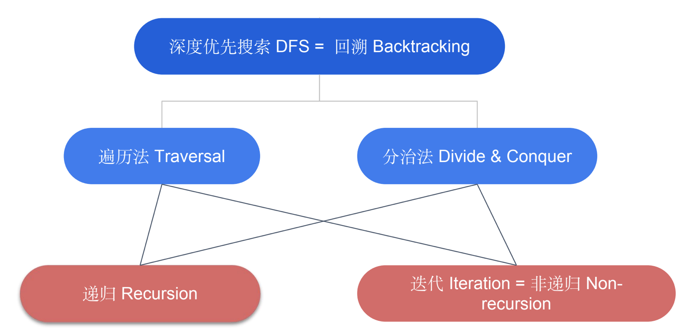

# Depth First Search (DFS, 深度優先搜索）

- 通常使用Recursion(遞歸)來實現
- 也可以不用Recursion（太深，怕StackOverflow時）, 如使用手動創建的Stack(棧)進行操作
- Backtracking(回溯)：即深度優先搜索算法
  - 遞歸函數在回到上一層遞歸調用處的時候，一些參數需要改回到調用前的值，回溯就是讓狀態函數回到之前的值的動作。 
- 二叉樹(binary tree)
  - 是每個節點最多有兩個子樹的樹結構
  - 高度最壞O(n), 最好O(logn)--Balanced Binary Tree, 一般用O(h)表示
  - 遇到二叉樹的問題，就想想**整棵樹**在該問題上的結果和**左右子樹**在該問題上的結果之間有什麼聯繫
  - 一棵二叉樹有O(n)棵子樹：葉子節點自己也是一棵
    - 定義：**任何一個節點作為根**，其下走到最下面，是一棵子樹 


 
## Traversal (遍歷) 
親力親為，一個小人拿著本子走遍所有的節點\
層序遍歷 (Level-order Traversal)詳見[BFS](https://github.com/chkao831/Algo_learning_notes/tree/main/BFS)


### [Pre-Order Traversal](https://github.com/chkao831/Algo_learning_notes/blob/main/DFS/LeetCode_144_Binary-Tree-Preorder-Traversal.md)(前序遍歷)
順序是根節點、左子節點、右子節點，根排在前面。\
`[1, 2, 4, 7, 8, 5, 3, 6, 9, 10]`
### [In-Order Traversal](https://github.com/chkao831/Algo_learning_notes/blob/main/DFS/LeetCode_94_Binary-Tree-Inorder-Traversal.md)(中序遍歷)
順序是左子節點、根節點、右子節點，根排在中間。\
`[7, 4, 8, 2, 5, 1, 3, 9, 6, 10]`
- Relevant: [Leet173 - Binary Search Tree Iterator](https://github.com/chkao831/Algo_learning_notes/blob/main/DFS/LeetCode_173_Binary-Search-Tree-Iterator.md)
- BST (Binary Search Tree): 
  - Def: 左子樹都比根節點小(<)
  - 右子樹都不小於(>=)根節點
  - 使用**中序遍歷**返回排序序列 (BST -> 保證 In-order)
  - 考的話，通常需要掌握中序遍歷的非遞歸版本
  - Red-Black Tree
    - 一種Balacned BST
    - Capabilities: 
      - O(logN)增刪查改
      - O(logN)找最大/最小
      - O(logN)找小於某數的upperBound/大於某數的lowerBound
  - BST Relevant:
    - [Lint95 - Validate Binary Search Tree](https://github.com/chkao831/Algo_learning_notes/blob/main/DFS/LintCode_95_Validate-Binary-Search-Tree.md)
    - [Lint230 - Kth Smallest Element in a BST](https://github.com/chkao831/Algo_learning_notes/blob/main/DFS/LintCode_230_Kth-Smallest-Element-in-a-BST.md)
    - [Lint 270](https://github.com/chkao831/Algo_learning_notes/blob/main/DFS/LeetCode_270_Closest-Binary-Search-Tree-Value.md), [Lint 272](https://github.com/chkao831/Algo_learning_notes/blob/main/DFS/LeetCode_272_Closest-Binary-Search-Tree-Value-II.md) - Closest Binary Search Tree Value I, II
    - BST的增刪查改
      - Lint11 - Search Range in Binary Search Tree (CH44 TBC)
      - Lint85 - Insert Node in a Binary Search Tree (CH44 TBC)
      - Lint87 - Remove Node in Binary Search Tree (CH44 TBC, optional)
### [Post-Order Traversal](https://github.com/chkao831/Algo_learning_notes/blob/main/DFS/LeetCode_145_Binary-Tree-Postorder-Traversal.md)(後續遍歷)
順序是左子節點、右子節點、根節點，根排在後面。\
`[7, 8, 4, 5, 2, 9, 10, 6, 3, 1]`
- Relevant: [Lint257 - Binary Tree Paths](https://github.com/chkao831/Algo_learning_notes/blob/main/DFS/LeetCode_257_Binary-Tree-Paths.md)
## Divide and Conquer (分治)
分而治之，分派小弟去做子任務，自己進行結果匯總\
通常會利用return value紀錄子問題結果\
左右必須沒有交集，otherwise DP\
二叉樹上的分治法模板：
```python
def divideAndConquer(TreeNode root):
    if root is None:
      處理空樹應該返回的結果
    if not root.left and not root.right:
      處理葉子應該返回的結果

    左子樹返回結果 = divideAndConquer(root.left)
    右子樹返回結果 = divideAndConquer(root.right)
    整棵樹的結果 = 合併左右樹的結果

    return 整棵樹的結果
```

這個模板基本上是用到[後序遍歷](https://github.com/chkao831/Algo_learning_notes/blob/main/DFS/LeetCode_145_Binary-Tree-Postorder-Traversal.md)的概念（左右子葉都算好，然後上去根）\
**注意**: 盡量避免常用全局變量(不利於multi-thread, 對共享變量加鎖帶來效率下降)可以把變量當作recursive call的return值（詳見[Lint596](https://github.com/chkao831/Algo_learning_notes/blob/main/DFS/LintCode_596_Minimum-Subtree.md))

- 二叉樹上求值/求路徑/求深度：
  - [Leet110 - Balanced Binary Tree](https://github.com/chkao831/Algo_learning_notes/blob/main/DFS/LeetCode_110_Balanced-Binary-Tree.md)
  - [Leet104 - Maximum Depth of Binary Tree](https://github.com/chkao831/Algo_learning_notes/blob/main/DFS/LeetCode_104_Maximum-Depth-of-Binary-Tree.md)
  - [Lint628 - Maximum Subtree](https://github.com/chkao831/Algo_learning_notes/blob/main/DFS/LintCode_628_Maximum-Subtree.md)
  - [Lint596 - Minimum Subtree](https://github.com/chkao831/Algo_learning_notes/blob/main/DFS/LintCode_596_Minimum-Subtree.md) (採用全局變量版/不採用全局變量版)
  - [Leet1120 - Maximum Average Subtree](https://github.com/chkao831/Algo_learning_notes/blob/main/DFS/LeetCode_1120_Maximum-Average-Subtree.md)
  - LCA (Lowest Common Ancestor, 最近公共祖先)
    - [LCA I](https://github.com/chkao831/Algo_learning_notes/blob/main/DFS/LintCode_88_Lowest-Common-Ancestor-of-a-Binary-Tree.md) (沒有父指針，兩個節點必定存在於樹) 
    - [LCA II](https://github.com/chkao831/Algo_learning_notes/blob/main/DFS/LintCode_474_Lowest-Common-Ancestor-II.md) (有父指針)
    - [LCA III](https://github.com/chkao831/Algo_learning_notes/blob/main/DFS/LintCode_578_Lowest-Common-Ancestor-III.md) (沒有父指針，兩個節點不一定存在於樹) 
- 二叉樹結構變化：
  - [Lint175 - Invert Binary Tree](https://github.com/chkao831/Algo_learning_notes/blob/main/DFS/LintCode_175_Invert-Binary-Tree.md)
  - [Lint453 - Flatten Binary Tree to Linked List](https://github.com/chkao831/Algo_learning_notes/blob/main/DFS/LintCode_453_Flatten-Binary-to-Linked-List.md)
