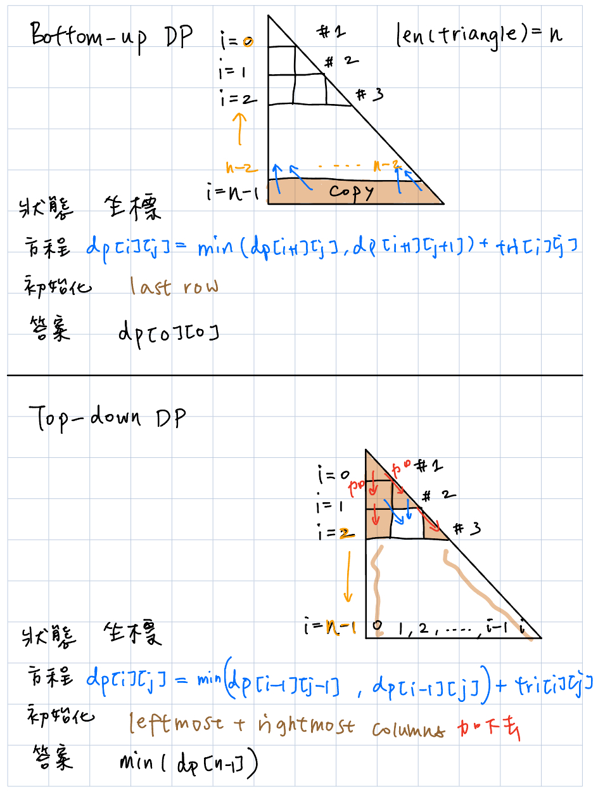

# Triangle
https://leetcode.com/problems/triangle/description/
>Given a triangle array, return the minimum path sum from top to bottom.
>
>For each step, you may move to an adjacent number of the row below. More formally, if you are on index `i` on the current row, you may move to either index `i` or index `i + 1` on the next row.

## DFS (Top down)
```python
class Solution:
    def __init__(self):
        self.global_min = sys.maxsize

    def minimumTotal(self, triangle: List[List[int]]) -> int:
        def dfs(x: int, y: int, cur_min: int):
            if x == len(triangle):
                if cur_min < self.global_min:
                    self.global_min = cur_min
                return
            dfs(x+1, y, cur_min+triangle[x][y])
            dfs(x+1, y+1, cur_min+triangle[x][y])
        
        dfs(x=0, y=0, cur_min=0)
        return self.global_min
```
#### Submission:
```
TLE
```
#### Complexity:
- Time: O(2^n) (left and right; like binary tree)
- Space: O(logN)


## DFS (Bottom Up)
關鍵：數字三角形左右是有重複計算的部分的，不是分開的二叉樹，所以可以用cache or memo降低時間複雜度 (from 2^N to N^2)

<p>
    
</p>
                                                      
```python
class Solution:

    def minimumTotal(self, triangle: List[List[int]]) -> int:
        
        @lru_cache(None)
        def dfs(x: int, y: int):
            if x == len(triangle):
                return 0
            left = dfs(x+1, y)
            right = dfs(x+1, y+1)
            return min(left, right) + triangle[x][y]
        
        return dfs(x=0, y=0)
```
#### Submission:
```
Runtime
84 ms
Beats
73.60%

Memory
17.6 MB
Beats
5.10%
```
#### Complexity:
- Time: O(N^2), with `@lru_cache ()`
- Space: O(N^2) (額外緩存空間）

## Memoization
使用一個哈希表，進行遞歸之前，先去看之前算過沒有。\
Key: 使用hashmap紀錄搜索的中間結果，下次通過同樣的參數訪問時，直接返回保存下來的結果。\
通過局部最優解，找全局最優解。\
記憶化搜索是DP的實現方式之一。
```python
from typing import List, Dict

class Solution:
    """
    @param triangle: a list of lists of integers
    @return: An integer, minimum path sum
    """
    def minimumTotal(self, triangle: List[List[int]]):
    
        def dfs(x: int, y: int, memo: Dict):
            if x == len(triangle):
                return 0
                
            if (x, y) in memo:
                return memo[(x, y)]

            left = dfs(x + 1, y, memo)
            right = dfs(x + 1, y + 1, memo)

            memo[(x, y)] = min(left, right) + triangle[x][y]
            return memo[(x, y)]

        return dfs(0, 0, {})
```
#### Submission:
```
Runtime
83 ms
Beats
74.43%

Memory
17 MB
Beats
12.20%
```
#### Complexity:
- Time: O(N^2)
- Space: O(N^2) (額外緩存空間）

## DP (Bottom Up)

<p>
    
</p>


```python
from typing import List, Dict

class Solution:
    """
    @param triangle: a list of lists of integers
    @return: An integer, minimum path sum
    """
    def minimumTotal(self, triangle: List[List[int]]):
    
        n = len(triangle)
        # state
        dp = [[0]*(i+1) for i in range(n)]

        # init
        for last_row_idx in range(n):
            dp[n-1][last_row_idx] = triangle[n-1][last_row_idx]

        # func
        for row in range(n-2, -1, -1):
            for entry in range(0, row+1):
                dp[row][entry] = min(dp[row+1][entry], dp[row+1][entry+1]) + triangle[row][entry]

        return dp[0][0]
```
#### Submission:
```
Runtime
69 ms
Beats
89.74%

Memory
15.1 MB
Beats
38.85%
```
#### Complexity:
- Time: O(N^2)
- Space: O(N^2) (or could do in-place without initializing an additional dp state matrix, would result in O(1) space)

## DP (Top Down)

```python
from typing import List, Dict

class Solution:
    """
    @param triangle: a list of lists of integers
    @return: An integer, minimum path sum
    """
    def minimumTotal(self, triangle: List[List[int]]):
    
        n = len(triangle)

        # init, in-place
        for row in range(1, n):
            triangle[row][0] = triangle[row-1][0] + triangle[row][0]
            triangle[row][row] = triangle[row-1][row-1] + triangle[row][row]

        # func
        for row in range(2, n):
            for entry in range(1, row):
                triangle[row][entry] = min(triangle[row-1][entry-1], triangle[row-1][entry]) + triangle[row][entry]

        return min(triangle[n-1])
```
#### Submission:
```
Runtime
58 ms
Beats
99.56%

Memory
14.9 MB
Beats
63.76%
```
#### Complexity:
- Time: O(N^2)
- Space: O(1)
