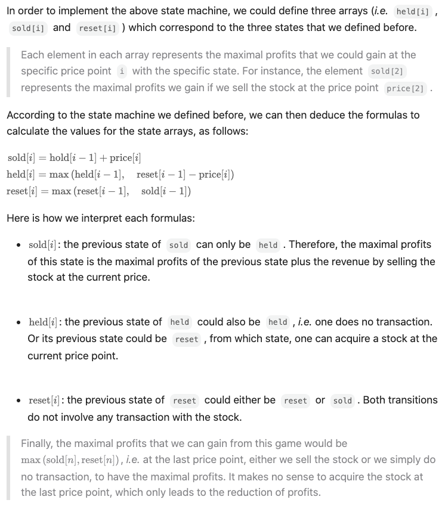

### Best Time to Buy and Sell Stock with Cooldown
https://leetcode.com/problems/best-time-to-buy-and-sell-stock-with-cooldown/description/
>You are given an array prices where `prices[i]` is the price of a given stock on the `ith` day.
>
>Find the maximum profit you can achieve. You may complete as many transactions as you like (i.e., buy one and sell one share of the stock multiple times) with the following restrictions:
>
>After you sell your stock, you cannot buy stock on the next day (i.e., cooldown one day).
>Note: You may not engage in multiple transactions simultaneously (i.e., you must sell the stock before you buy again)

<p>
    
</p>

<p>
    
</p>

```python
class Solution(object):
    def maxProfit(self, prices):
        """
        :type prices: List[int]
        :rtype: int
        """
        sold, held, reset = float('-inf'), float('-inf'), 0

        for price in prices:
            # the calculation is done in parallel.
            sold, held, reset = held + price, max(held, reset-price), max(reset, sold)

        return max(sold, reset)
```
#### Remark:
- 
#### Submission:
```
Runtime
74 ms
Beats
63.18%

Memory
14.1 MB
Beats
81.39%
```
#### Complexity:
- Time: O(N)
- Space: O(1)
