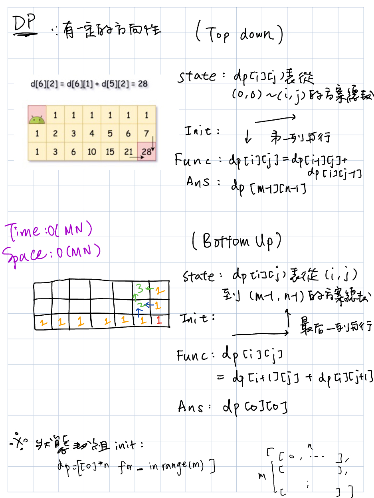
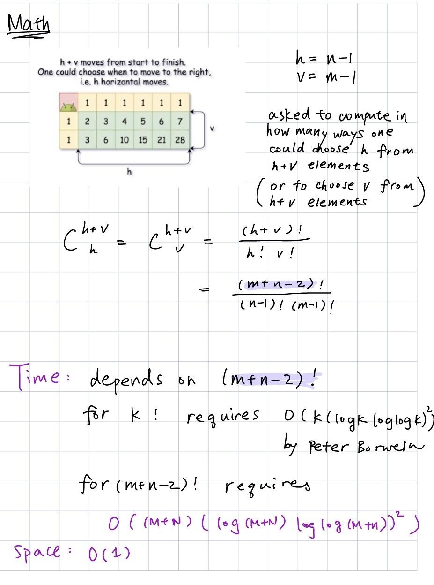

# Unique Paths
https://leetcode.com/problems/unique-paths/description/
>Given the two integers `m` and `n`, return the number of possible unique paths that the robot can take to reach the bottom-right corner.

## DFS
```python
DIR = [(1, 0), (0, 1)]

class Solution:
    def uniquePaths(self, m: int, n: int) -> int:
        def dfs(x: int, y: int):

            nonlocal output

            def _is_valid(i: int, j: int) -> bool:
                if not 0<=i<m or not 0<=j<n:
                    return False
                # if visited?
                return True

            if (x, y) == (m-1, n-1):
                output += 1
                return
            for d in DIR:
                if not _is_valid(x+d[0], y+d[1]):
                    continue
                # subpath.append((x+d[0], y+d[1]))
                dfs(x+d[0], y+d[1])
                # subpath.pop()
        output = 0
        dfs(x=0, y=0)
        return output
```
#### Remark:
- 
#### Submission:
```
TLE
```
#### Complexity:
- Time: O(2^(MN))
- Space: O(M+N)

## DP

<p>
    
</p>


### Top Down
```python
class Solution:
    def uniquePaths(self, m: int, n: int) -> int:

        dp = [[1]*n for _ in range(m)]
        for row in range(1, m):
            for col in range(1, n):
                dp[row][col] = dp[row-1][col] + dp[row][col-1]
        return dp[m-1][n-1]
```
#### Submission:
```
Runtime
30 ms
Beats
92.38%

Memory
13.9 MB
Beats
31%
```
### Bottom Up
```python
class Solution:
    def uniquePaths(self, m: int, n: int) -> int:

        dp = [[1]*n for _ in range(m)]
        for row in range(1, m):
            for col in range(1, n):
                dp[row][col] = dp[row-1][col] + dp[row][col-1]
        return dp[m-1][n-1]
```
#### Submission:
```
class Solution:
    def uniquePaths(self, m: int, n: int) -> int:

        dp = [[1]*n for _ in range(m)]
        for row in range(m-2, -1, -1):
            for col in range(n-2, -1, -1):
                dp[row][col] = dp[row+1][col] + dp[row][col+1]
        return dp[0][0]
```

## Math (Binomial Coefficient)

<p>
    
</p>

```python
from math import factorial

class Solution:
    def uniquePaths(self, m: int, n: int) -> int:
        return factorial(m+n-2) // factorial(n-1) // factorial(m-1)
```
#### Submission:
```
Runtime
37 ms
Beats
74.15%

Memory
14 MB
Beats
31%
```

