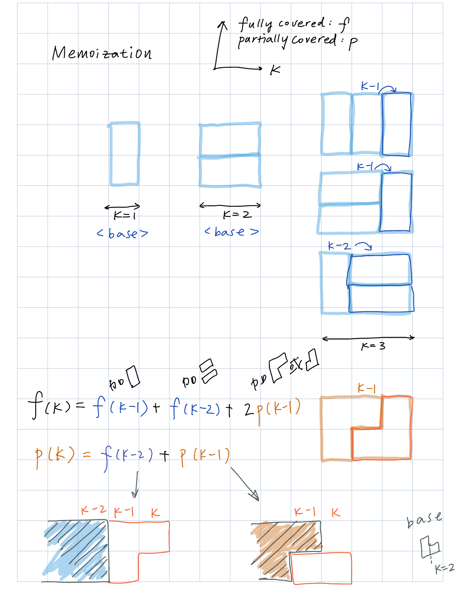

### Domino and Tromino Tiling
https://leetcode.com/problems/domino-and-tromino-tiling/description/

<p>
    
</p>

>Given an integer `n`, return the number of ways to tile an `2 x n` board. Since the answer may be very large, return it modulo `10^9 + 7`.

<p>
    
</p>


```python
class Solution:
    def numTilings(self, n: int) -> int:
        MOD = 1_000_000_007

        @lru_cache(None)
        def f(k) -> int:
            if k <= 2:
                return k
            return (f(k-1) + f(k-2) + 2*p(k-1)) % MOD

        @lru_cache(None)
        def p(k) -> int:
            if k == 2:
                return 1
            return (p(k-1) + f(k-2)) % MOD

        return f(k=n)
```

#### Submission:
```
Runtime
50 ms
Beats
73.2%

Memory
16.5 MB
Beats
19.6%
```
#### Complexity:
- Time: O(N)
  - From top (N) to bottom (1), there will be N non-memoized recursive calls to f and to p, where each non-memoized call requires constant time. Thus, O(2⋅N) time is required for the non-memoized calls.
  - Furthermore, there will be 2⋅N memoized calls to f and N memoized calls to p, where each memoized call also requires constant time. Thus O(3⋅N) time is required for the memoized calls.
  - This leads to a time complexity of O(2⋅N+3⋅N)=O(N)
- Space: O(N)
  - Each recursion call stack will contain at most N layers. Also, each hashmap will use O(N) space. Together this results in O(N) space complexity. 
