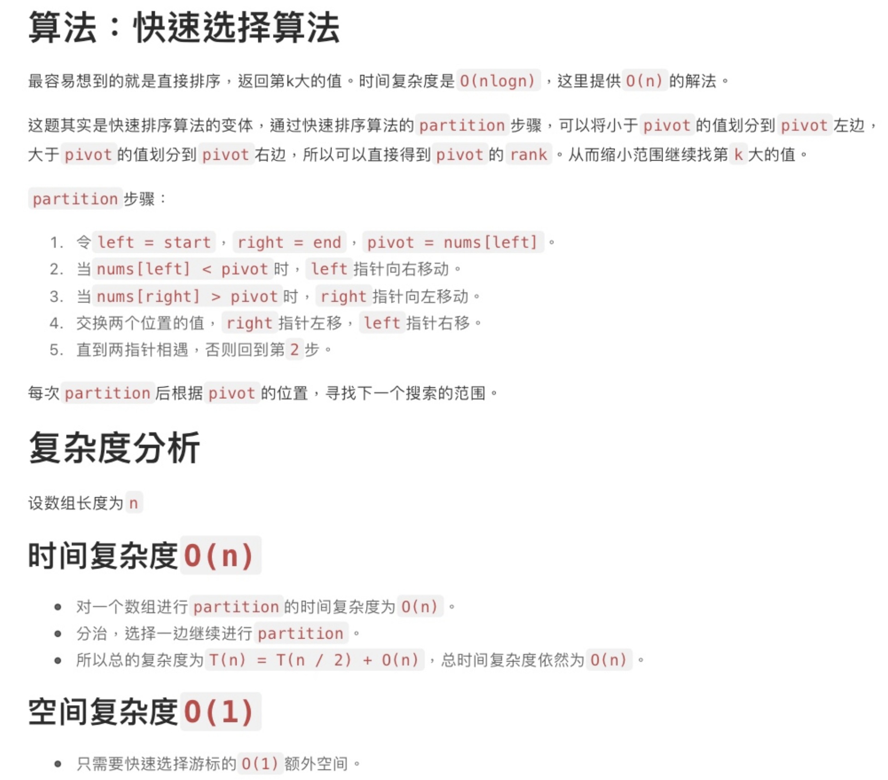
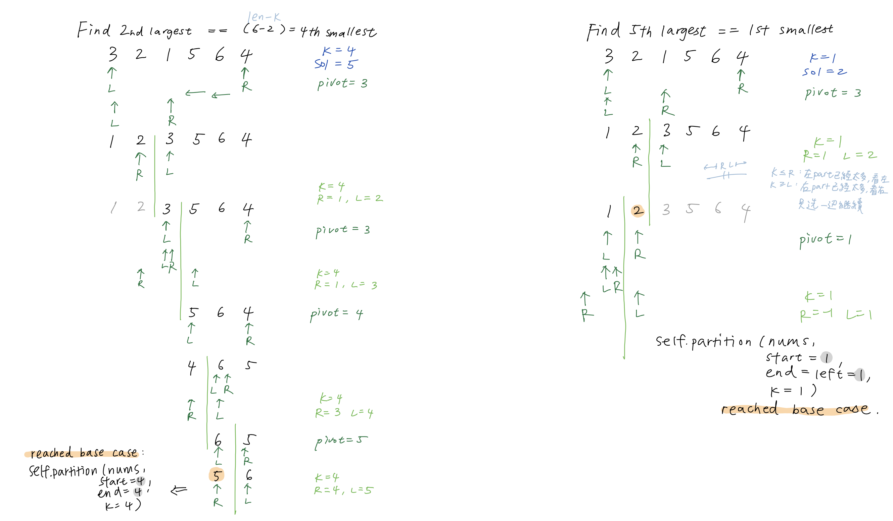

### Kth Largest Element in an Array
https://leetcode.com/problems/kth-largest-element-in-an-array/
>Given an integer array nums and an integer k, return the kth largest element in the array.
>
>Note that it is the kth largest element in the sorted order, not the kth distinct element.
>
>You must solve it in O(n) time complexity.




```python
class Solution:
    def findKthLargest(self, nums: List[int], k: int) -> int:
        if not nums or k < 1 or k > len(nums): return None
        return self.QuickSelect(nums=nums, start=0, end=len(nums)-1, k=len(nums)-k)
    
    def QuickSelect(self, nums: List[int], start: int, end: int, k: int):
        # base case
        if start == end:
            return nums[k]
        # recursive case
        left, right = start, end
        pivot = nums[(left + right)//2]
        while left <= right:
            while (left <= right and nums[left] < pivot):
                left += 1
            while (left <= right and nums[right] > pivot):
                right -= 1
            if (left <= right):
                nums[left], nums[right] = nums[right], nums[left]
                left, right = left+1, right-1
        # choose either side
        if k <= right:
            self.QuickSelect(nums=nums, start=start, end=right, k=k)
        if k >= left:
            self.QuickSelect(nums=nums, start=left, end=end, k=k)
        return nums[k]
```


#### Remark:
- Mistakes:
  - `pivot = nums[(left + right)//2]`, not `(left + right)//2`
  - forgot the `return nums[k]` at the bottom of `def QuickSelect(self)` and function call within `def findKthLargest()`.
- QuickSelect highly resembles [QuickSort](https://github.com/chkao831/Algo_learning_notes/blob/main/DnC/LintCode_464_Sort-Integers-II_QuickSort.md), except that to choose the k-th largest, one wouldn't proceed recursively to use quicksort for the both parts that would result in O(nlogn) time complexity. In this case, there is no need to deal with both parts since now one knows in which part to search for N - kth smallest element, and that reduces average time complexity to O(n).

#### Submission:
```
Runtime: 1472 ms, faster than 20.69% of Python3 online submissions for Kth Largest Element in an Array.
Memory Usage: 27.1 MB, less than 62.85% of Python3 online submissions for Kth Largest Element in an Array.
```
#### Complexity:
- Time: O(n) on average, while O(n^2) still its worst case.
- Space: O(1)
