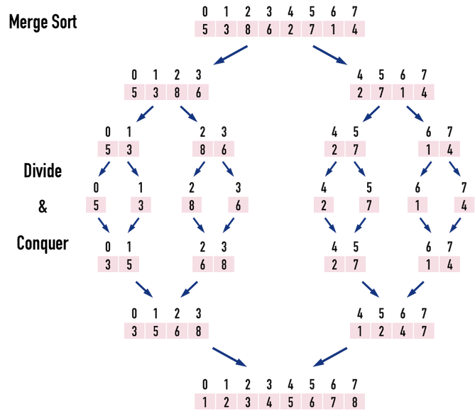
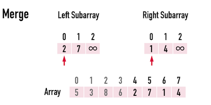
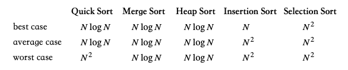

### Sort an Array
https://leetcode.com/problems/sort-an-array/
>Given an array of integers nums, sort the array in ascending order and return it.
>
>You must solve the problem without using any built-in functions in O(nlog(n)) time complexity and with the smallest space complexity possible.




```python
class Solution:
    def __init__(self):
        self.temp = []
        
    def sortArray(self, nums: List[int]) -> List[int]:
        if not nums:
            return nums
        self.temp = [0]*len(nums)
        self.mergeSort(start=0, end=len(nums)-1, nums=nums)
        return nums
    
    def mergeSort(self, start: int, end: int, nums: List[int]):
        # base case
        if start >= end:
            return
        # recursive
        middle = (start + end)//2
        ## DIVIDE
        self.mergeSort(start=start, end=middle, nums=nums) # keep dividing left array, O(n)
        self.mergeSort(start=middle+1, end=end, nums=nums) # keep dividing right array, O(n)
        ## CONQUER
        self.merge(start=start, end=end, nums=nums) # merge, O(nlogn)
        
    def merge(self, start: int, end: int, nums: List[int]):
        middle = (start+end)//2
        left, right = start, middle+1
        index = start
        # while both haven't reached their ends, compare left with right
        while left <= middle and right <= end: 
            if nums[left] <= nums[right]: # left smaller, add left
                self.temp[index] = nums[left]
                left, index = left+1, index+1
            else:
                self.temp[index] = nums[right] # right smaller, add right
                right, index = right+1, index+1
        # left hasn't reached its end, put remaining left elements in
        while left <= middle:
            self.temp[index] = nums[left]
            left, index = left+1, index+1
        # right hasn't reached its end, put remaining right elements in
        while right <= end:
            self.temp[index] = nums[right]
            right, index = right+1, index+1
        # replacement
        for i in range(start, end+1):
            nums[i] = self.temp[i]
```
#### Remark:
- Stable Sorting
  - Stable Sorting (穩定排序）：如果鍵值相同之資料，在排序後相對位置與排序前相同時，稱穩定排序。 
  - ex. [3, 2, 2, 1] -> [1, 2, 2, 3] 其中兩個2相對位置不變
  - Stable Sorting: Insertion Sort, Bubble Sort, Merge Sort
  - Unstable Sorting: Quick Sort, Heap Sort
- Guaranteed O(nlogn)

  

  - Unlike Quick Sort, which might fall into worst case (O(n^2))
  - Reason: Every time, Merge Sort guarantees to partition into two
  - Divide O(n) + Conquer O(nlogn) = O(nlogn)
- 在歸併兩個數列時，需要額外空間。
- Reference: https://alrightchiu.github.io/SecondRound/comparison-sort-merge-sorthe-bing-pai-xu-fa.html
#### Submission:
```
Runtime: 4637 ms, faster than 5.02% of Python3 online submissions for Sort an Array.
Memory Usage: 21.6 MB, less than 66.36% of Python3 online submissions for Sort an Array.
```
#### Complexity:
- Time: O(nlogn)
- Space: O(n)
