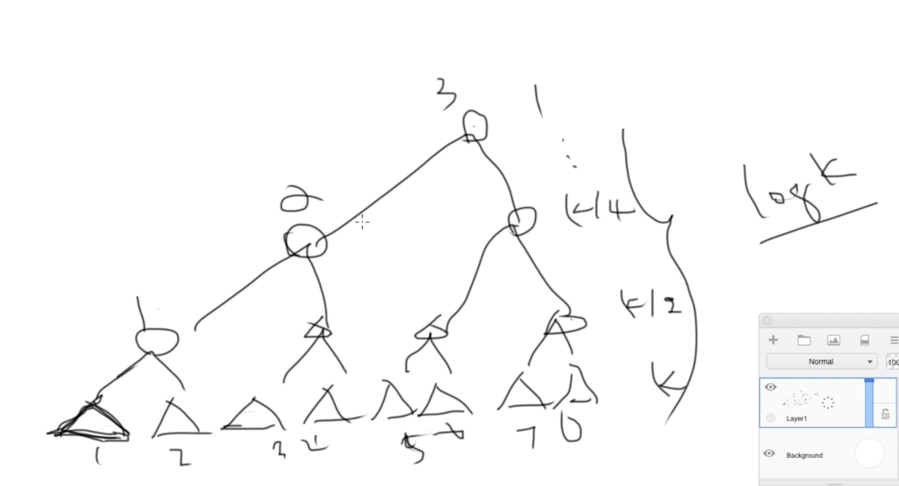

# Merge K Sorted Lists
https://www.lintcode.com/problem/104/description
>

## 1. Heap (non-recursive)

```python
"""
Definition of ListNode
class ListNode(object):

    def __init__(self, val, next=None):
        self.val = val
        self.next = next
"""

## 1. Heap

# overwrite the compare function 
# so that we can directly put ListNode into heapq
ListNode.__lt__ = lambda x, y: (x.val < y.val)

from heapq import heappush, heappop

class Solution:
    """
    @param lists: a list of ListNode
    @return: The head of one sorted list.
    """
    def mergeKLists(self, lists):
        if not lists:
            return None
        
        dummy = tail = ListNode(0)
        heap = []
        for head in lists:
            if head:
                heappush(heap, head)
                
        while heap:
            head = heappop(heap)
            tail.next = head
            tail = head
            if head.next:
                heappush(heap, head.next)
                    
        return dummy.next
```
#### Remark:
- 非常類似[Lint471-Top K Frequent Words](https://github.com/chkao831/Algo_learning_notes/blob/main/Heap/LintCode_471_Top-K-Frequent-Words.md)的做法，藉由class的`__lt__`, 其中加入比較條件
    - 因為比較的元素是`ListNode`，這個單純是不comparable的
    - 開始寫的時候加入heap的本來是`(ListNode.val, ListNode)`，以為可以靠val比較。然而，tuple比較的時候，如果`（node1.val, node1）`和`（node2.val,node2）`同時存在，heap在計算最小值的時候需要比較，如果`node1.val`和`node2.val`一樣，那麼node1和node2就需要比較，但這兩個Listnode不支持比較，會報錯。所以需要`__lt__`。
#### Submission:
```
1167 ms
time cost
·
8.96 MB
memory cost
·
Your submission beats
13.80 %
Submissions
```
#### Complexity:
- Time: O(NlogK)
    - Heap的大小是維持在K，while loop裡面做的操作是logK級別的。while loop會執行N次。
- Space: O(N)

## 2. 兩兩歸併 (Pairwise Merge, non-recursive)

```python
"""
Definition of ListNode
class ListNode(object):

    def __init__(self, val, next=None):
        self.val = val
        self.next = next
"""

class Solution:
    """
    @param lists: a list of ListNode
    @return: The head of one sorted list.
    """
    def mergeKLists(self, lists):
        if not lists:
            return None

        while len(lists) > 1:
            merged_combo = []
            for i in range(0, len(lists), 2):
                merged = []
                if (i+1) == len(lists):
                    merged = lists[i]
                else:
                    merged = self.merge_two_lists(l1=lists[i], l2=lists[i+1])
                merged_combo.append(merged)
            lists = merged_combo
        return lists[0]

    def merge_two_lists(self, l1: ListNode, l2: ListNode) -> ListNode:
        
        head = tail = ListNode(0) # dummy head
        while l1 and l2:
            if l1.val <= l2.val:
                tail.next = l1
                tail = tail.next
                l1 = l1.next
            else:
                tail.next = l2
                tail = tail.next
                l2 = l2.next
        if l1:
            tail.next = l1
        if l2:
            tail.next = l2
        return head.next
```
#### Remark:
- `def merge_two_lists`完全複製[Lint165](https://github.com/chkao831/Algo_learning_notes/blob/main/ExternalSorting/LintCode_165_Merge-Two-Sorted-Lists.md)，使用合併數組的方法，兩個指針比較、往後走。
- Unlike the array version, note that
  - it's `head = tail = ListNode(0)`, don't mistype as `head, tail = ListNode(0)`
  - it's `while l1 and l2`, not `while l1.val and l2.val`
  - at the end, it's `if l1` and `if l2` (just link the remainings), not `while...`, otherwise infinite loop 
- 每個數最多參與logK次的歸併，總共N個數 => O(NlogK)
    <p>
        
    </p>

#### Submission:
```
1083 ms
time cost
·
8.89 MB
memory cost
·
Your submission beats
61.20 %
Submissions
```
#### Complexity:
- Time: O(NlogK)
- Space: O(N)

## 3. Merge sort, Divide and Conquer (Recursive)

```python
from typing import List

class Solution:
    """
    @param lists: a list of ListNode
    @return: The head of one sorted list.
    """
    def mergeKLists(self, lists: List):
        if not lists:
            return None
        return self.divide_and_conquer(lists=lists, start=0, end=len(lists)-1)

    def divide_and_conquer(self, lists: List, start: int, end: int) -> ListNode:
        if start >= end:
            return lists[start]
        mid = (start+end)//2
        left = self.divide_and_conquer(lists=lists, start=start, end=mid)
        right = self.divide_and_conquer(lists=lists, start=mid+1, end=end)
        return self.merge_two_lists(l1=left, l2=right)

    def merge_two_lists(self, l1: ListNode, l2: ListNode) -> ListNode:
    
        head = tail = ListNode(0) # dummy head
        while l1 and l2:
            if l1.val <= l2.val:
                tail.next = l1
                tail = tail.next
                l1 = l1.next
            else:
                tail.next = l2
                tail = tail.next
                l2 = l2.next
        if l1:
            tail.next = l1
        if l2:
            tail.next = l2
        return head.next
```
#### Remark:
- Similarly, `def merge_two_lists`完全複製[Lint165](https://github.com/chkao831/Algo_learning_notes/blob/main/ExternalSorting/LintCode_165_Merge-Two-Sorted-Lists.md)，使用合併數組的方法，兩個指針比較、往後走。
- [Merge Sort](https://github.com/chkao831/Algo_learning_notes/blob/main/DnC/LeetCode_913_Sort-an-Array.md)
#### Submission:
```
1046 ms
time cost
·
8.86 MB
memory cost
·
Your submission beats
83.80 %
Submissions
```
#### Complexity:
- Time: O(NlogK)
- Space: O(N)
