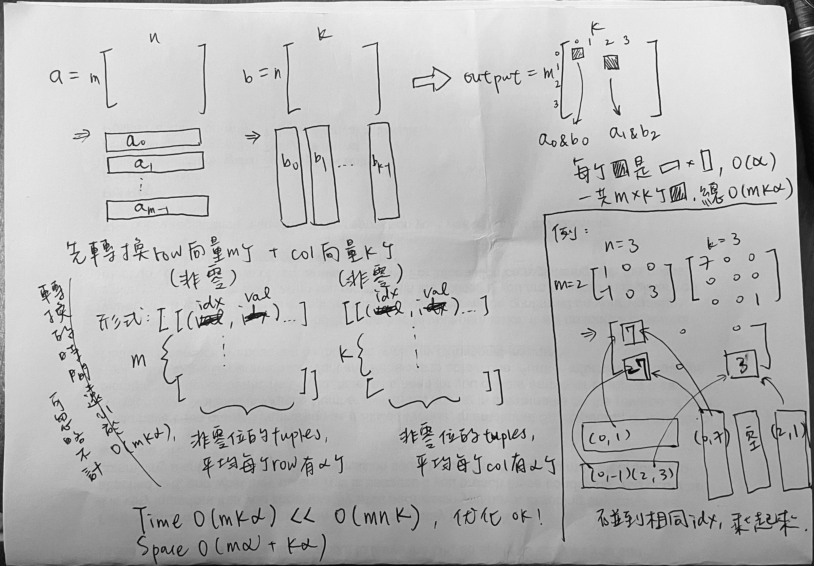

### Sparse Matrix Multiplication
https://www.lintcode.com/problem/654/
>Given two Sparse Matrix A and B, return the result of AB.
>
>You may assume that A's column number is equal to B's row number.

<p>
    
</p>

```python
from typing import (
    List,
)

class Solution:
    """
    @param a: a sparse matrix
    @param b: a sparse matrix
    @return: the result of A * B
    """
    def multiply(self, a: List[List[int]], b: List[List[int]]) -> List[List[int]]:

        m, n, k = len(a), len(a[0]), len(b[0])
        nonzero_idx_val_a, nonzero_idx_val_b = [], []

        # get row composition of matrix a
        for row in range(m):
            row_list = []
            for col in range(n):
                if a[row][col] != 0:
                    row_list.append((col, a[row][col]))
            nonzero_idx_val_a.append(row_list)
        # get col composition of matrix b
        for col in range(k):
            col_list = []
            for row in range(n):
                if b[row][col] != 0:
                    col_list.append((row, b[row][col]))
            nonzero_idx_val_b.append(col_list)

        # for an entry indexed (i, j), it's calculated with ith row from nonzero_idx_val_a
        # and jth col from nonzero_idx_val_b
        output = []
        for i in range(m):
            output_row = []
            for j in range(k):
                target_row, target_col = nonzero_idx_val_a[i], nonzero_idx_val_b[j]
                a_idx, b_idx, cur_sum = 0, 0, 0
                while a_idx < len(target_row) and b_idx < len(target_col):
                    if target_row[a_idx][0] < target_col[b_idx][0]:
                        a_idx += 1
                    elif target_row[a_idx][0] > target_col[b_idx][0]:
                        b_idx += 1
                    else:
                        cur_sum += target_row[a_idx][1] * target_col[b_idx][1]
                        a_idx, b_idx = a_idx+1, b_idx+1
                output_row.append(cur_sum)
            output.append(output_row)
        return output
```
#### Remark:
- 一般矩陣`n*m`與矩陣`m*k`乘法耗費時間`O(n*m*k)`
- For sparse matrix, 假設每一行或每一列平均非零元素個數為 α
  - 先分開轉換row向量和col向量
    - 向量裡的tuple紀錄非零（位置, 值） = (idx, val) 
  - 針對entry (i, j), 取row向量的第i條和col向量的第j條來乘&加起來
    - 用合併數組的technique來算，遇到相同idx才做配對運算
- 平均每行非零個數 α << n
  - 時間複雜度降到O(mkα)

#### Submission:
```
113 ms
time cost
·
6.17 MB
memory cost
·
Your submission beats
34.80 %
Submissions
```
#### Complexity:
- Time: O(m*k*α)
- Space: O(mα + kα)
