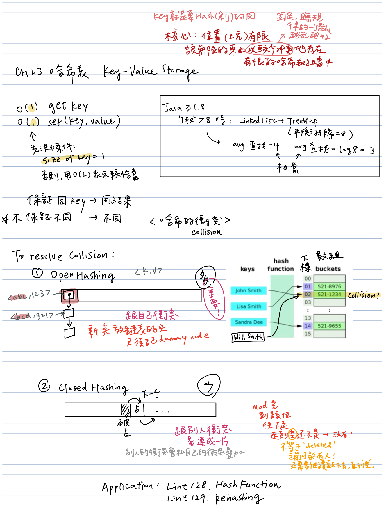

# HashMap (Python dictionary)

- 存儲具有映射關係的數據。
- HashMap has complexity of O(1) for insertion and lookup.
- Keys could not duplicate.
- Not ordered.
> Side Note: TreeMap和HashMap不同，是有序的。

## HashMap (dict) vs. HashSet (set)
哈希表的出現是為瞭解決鏈表訪問不快速的弱點，哈希表也稱散列表。
|  | HashMap | HashSet |
|---|---|---|
| Purpose | 實現了Map接口 | 實現Set接口 |
| Content | 其內容是鍵值對的映射（key->value），不允許出現相同的鍵（key）。在查詢的時候會根據給出的鍵來查詢對應的值。 | 其內部不允許出現重復的值，如果我們將一個對象存入HashSet，必須重寫equals()和hashCode()方法，這樣才能確保集合中不存在同一個元素。HashSet的內部是無序的，因此不能使用 hashset.get(index) 來獲取元素 |
| Implementation | 底層是一個數組結構，數組中的每一項對應了一個鏈表 |  |
| Key: Value | k: v | k: None |
| Storage Process | 1. 調用hashCode(), 返回對應的hashCode, 作為哈希表的索引 2-1. 若當前位置內容為空，則把HashMap的Key、Value包裝成Entry數組，放入當前位置 2-2. 若當前位置內容不為空，則繼續查找當前索引處存放的鏈表，利用equals方法，找到Key相同的Entry數組，則用當前Value去替換舊的Value 3. 若未找到與當前Key值相同的對象，則把當前位置的鏈表後移（Entry數組持有一個指向下一個元素的引用），把新的Entry數組放到鏈表表頭 | 1. 調用hashCode(), 返回對應的hashCode, 然後通過元素的哈希值經過移位等運算，就可以算出該元素在哈希表中的存儲位置 2-1. 若當前位置內容為空，那麼該元素可以直接存儲到該位置上 2-2. 若當前位置內容不為空，那麼會調用該元素的equals方法與該位置的元素再比較一次 2-2-1. 如果equals返回的是true，那麼該元素與這個位置上的元素就視為重復元素，不允許添加 2-2-2. 如果equals方法返回的是false，那麼該元素運行添加 |
| Add Call | 調用put（）向map中添加元素 | 調用add（）方法向Set中添加元素 |
| Hashcode | HashMap使用鍵（Key）計算Hashcode | HashSet使用成員對象來計算hashcode值，對於兩個對象來說hashcode可能相同，所以equals()方法用來判斷對象的相等性，如果兩個對象不同的話，那麼返回false |

我們可以認為，HashSet和HashMap增查操作的時間複雜度都是常數級的。\
考點：\
1.是否會靈活的使用哈希表解決問題\
2.是否熟練掌握哈希表的基本原理

## Hashing

    

衝突（Collision），是說兩個不同的 key 經過哈希函數的計算後，得到了兩個相同的值。解決衝突的方法，主要有兩種：

開散列法（Open Hashing）。是指哈希表所基於的數組中，每個位置是一個 Linked List 的頭結點。這樣衝突的 <key, value> 二元組，就都放在同一個鏈表中。\
閉散列法（Closed Hashing）。是指在發生衝突的時候，後來的元素，往下一個位置去找空位。

## Relevant Items
| Item | Topic | Remark | Link(s) |
|  ----  |  ----  | ----  | ----  |
| 1 | Two Sum & Extension | O(1) add; O(n) find two sum | [Leet1](https://github.com/chkao831/Algo_learning_notes/blob/main/Hashmap/LeetCode_1_Two-sum.md), [Lint607](https://github.com/chkao831/Algo_learning_notes/blob/main/Hashmap/LintCode_607_Two-Sum-III-Data-structure-design.md), [Leet454](https://github.com/chkao831/Algo_learning_notes/blob/main/Hashmap/LeetCode_454_4Sum-II.md), [Lint716](https://github.com/chkao831/Algo_learning_notes/blob/main/Hashmap/LintCode_716_Add-and-Search.md) |
