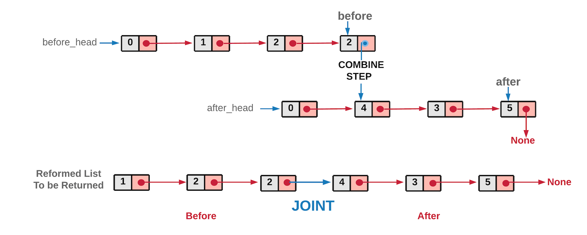

### Partition List
https://leetcode.com/problems/partition-list/
>Given the head of a linked list and a value x, partition it such that all nodes less than x come before nodes greater than or equal to x.
>
>You should preserve the original relative order of the nodes in each of the two partitions.



```python
# Definition for singly-linked list.
# class ListNode:
#     def __init__(self, val=0, next=None):
#         self.val = val
#         self.next = next
class Solution:
    def partition(self, head: Optional[ListNode], x: int) -> Optional[ListNode]:
        
        former = former_head = ListNode(0)
        latter = latter_head = ListNode(0)
        
        while head:
            curr_next = head.next
            if head.val < x:
                former.next = head
                former = former.next
            else: # head.val >= x
                latter.next = head
                latter = latter.next
            head = curr_next
        
        # print(latter_head.next)
        latter.next = None
        former.next = latter_head.next
        
        return former_head.next
```
#### Remark:
- Remember `latter.next = None`, since the last node of "after" list would also be ending node of the reformed list. 
#### Submission:
```
Runtime: 1927 ms, faster than 5.59% of Python3 online submissions for Partition List.
Memory Usage: 14.4 MB, less than 29.00% of Python3 online submissions for Partition List.
```
#### Complexity:
- Time: O(n)
- Space: O(1)
