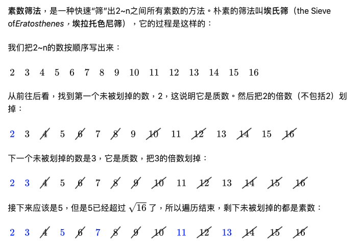

### Kth Prime Number
https://www.lintcode.com/problem/792/description
> Given the prime number n, output the number of prime numbers



```python
class Solution:
    """
    @param n: the number
    @return: the rank of the number
    """
    def kthPrime(self, n):
        prime = [0] * 100000
        for i in range(2,n):
            if prime[i] == 0:
                for j in range(i * i, n, i):
                    prime[j] = 1
        ans = 1
        for i in range(2,n):
            if prime[i] == 0:
                ans += 1
        return ans
```
#### Remark:
- 
#### Submission:
```
122 ms
time cost
·
6.56 MB
memory cost
·
Your submission beats
89.93 %
Submissions
```
#### Complexity:
- Time: O(nloglogn)
