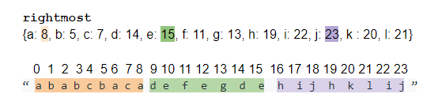

### Partition Labels
https://leetcode.com/problems/partition-labels/
>You are given a string s. We want to partition the string into as many parts as possible so that each letter appears in at most one part.
>
>Note that the partition is done so that after concatenating all the parts in order, the resultant string should be s.\
>Return a list of integers representing the size of these parts.



```python
class Solution:
    def partitionLabels(self, s: str) -> List[int]:
        # get the rightmost index for each letter
        hashmap = {letter: i for i, letter in enumerate(s)}
        list_of_sizes = []
        
        left, right = 0, 0
        for i, letter in enumerate(s):
            right = max(right, hashmap[letter])
            if i == right:
                list_of_sizes.append(right - left + 1)
                left = right + 1
        return list_of_sizes
```
#### Remark:
- Figure out the rightmost index first and use it to denote the start of the next section.
- Reset the left pointer at the start of each new section.
- Store the difference of right and left pointers + 1 as in the result for each section.
#### Submission:
```
Runtime: 92 ms, faster than 13.52% of Python3 online submissions for Partition Labels.
Memory Usage: 13.8 MB, less than 97.74% of Python3 online submissions for Partition 
```
#### Complexity:
- Time: O(n)
- Space: O(n)
