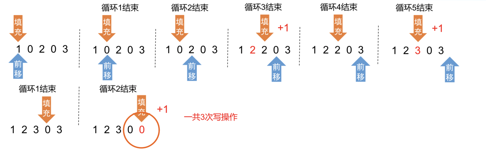

### Move Zeroes
https://www.lintcode.com/problem/539/
>Given an array nums, write a function to move all 0's to the end of it while maintaining the relative order of the non-zero elements.

```python
```
#### Remark:
- 
#### Submission:
```
```
#### Complexity:
- Time:
- Space:
